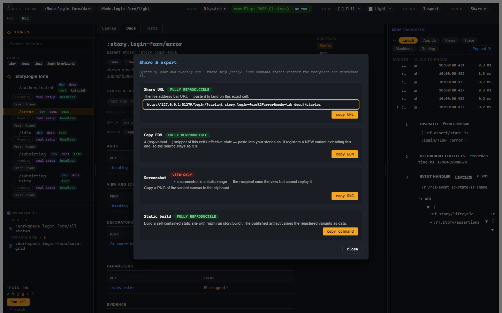

# 8. Snapshot identity and sharing

You want to send a useful state to someone else, and you want visual-regression
keys that do not explode every time you rename a variant. This chapter covers
Story's content identity and the Share dialog. The theme is the same as the rest
of Story: share the artifact, but say honestly what the recipient can reproduce.

## Content identity

A variant has a name, but names are not stable enough for every job. You can
rename `:story.login/error` to `:story.auth/login-error` without changing the
state it renders. You can also keep the name and change the state completely.

Story therefore computes identity over canonical content, not just the keyword.

The important hashes are:

| Hash | Answers |
|---|---|
| plan hash | Is this the same normalized plan? |
| run hash | Did this run behave the same way? |
| snapshot identity | What should a visual-regression capture key use? |

This is what lets a visual tool distinguish a rename from a real state change.
Story does not need to be the pixel-diff service. It needs to hand the pixel
service a stable, meaningful key.

## Sharing

The Share dialog exposes the common handoff paths.



The commands are:

| Command | What it gives |
|---|---|
| Share URL | The current Story URL, including selected variant/workspace and mode state. |
| Copy EDN | A `reg-variant`-shaped snippet for the selected state. |
| Screenshot | A PNG of the canvas. |
| Static build | The command for producing a standalone Story site. |

The browser address bar is already meaningful. Selecting
`:story.login/error` produces a URL like:

```text
http://localhost:8041/?variant=story.login%2Ferror#/stories
```

That is a small thing, but small things matter. If a tool has a stateful UI and
the URL is useless, it is making you do filing work in your head.

## Reproducibility labels

Each share path states how reproducible it is:

| Label | Meaning |
|---|---|
| Fully reproducible | The recipient can land on the same state. |
| Partially reproducible | Some state carries, but something is omitted or approximate. |
| View-only | The artifact shows the state but cannot replay it. |

A screenshot is view-only. That is not a moral failure; it is a static image.
The useful part is that the UI says so.

Copy EDN can be fully reproducible when the current state can be expressed as a
variant body. If live controls, transient frame state, or non-serializable
values cannot be represented, the save/share path should warn rather than
inventing a variant that only sort of means what you saw.

## Save current versus promote

This is worth repeating because it prevents two workflows from collapsing into
one button.

**Save current state as variant** is for authored examples. You have a useful
state in the canvas and want to name it.

**Promote run to regression variant** is for evidence. A run failed or found an
interesting case and you want to keep it as a curated regression.

Both end with a variant. They start from different places and carry different
provenance. Keeping them separate makes the source history easier to trust.

## Static builds

The static build command packages the registered Story catalogue into a
self-contained site. Use it for design review, documentation previews, or
artifact hosting where the reviewer should not need your dev server.

Static export is still Story, not a screenshot album. Variants remain registered
data, with docs, controls, and status presentation where the build includes the
needed runtime.

## Privacy boundaries

There are two different questions people often blend:

- Can this artifact reproduce the state?
- Should this value leave the machine?

The Share dialog answers the first question. The MCP and logging boundaries
answer the second. Story core operates on real values inside your dev process;
wire-facing tools such as Story-MCP apply redaction/elision when values cross
the agent boundary.

The share URL, copied EDN, static build, and screenshot ARE re-frame2-created
artifacts — which the framework's egress policy scopes in. They ship unredacted:
a human pressing share / copy / export is the trusted-local operator revealing
their own frame (the same intent as the framework's `:rf.egress/local-raw`
boundary), of an app they already have full access to. A recipient of a shared
artifact sees what the operator chose to share, exactly as when pasting console
output. Redaction lives at the off-box boundaries (MCP / logs), not on this
human egress UX.

This keeps local developer tooling useful without pretending a screenshot or
URL is a security boundary.
