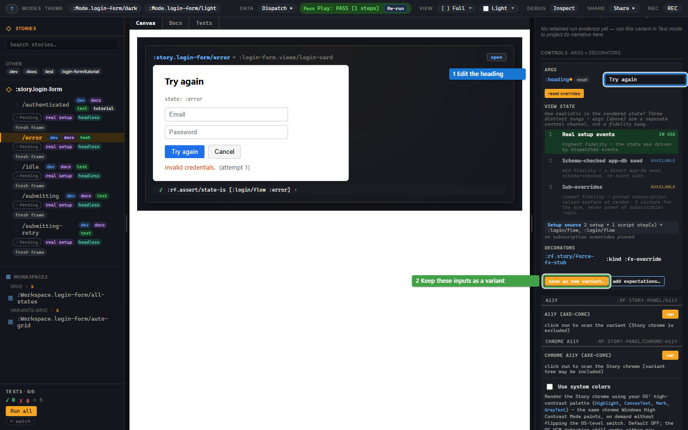

# Edit inputs and keep a useful state

Use Controls to try view inputs without changing source. When a combination
is useful, save it as a variant so it becomes an example you can reopen.

In the login testbed, select `:story.login-form/error`, open **Controls**
in the right rail and change `:heading` to `Try again`.

[](../images/story/story-tutorial-10-controls.png)

The heading changes; the machine stays in its declared error state.
**reset** removes live overrides and returns the args to their declared
values. Controls edits inputs the view receives, rather than arbitrary
component-local state.

## Save the current state as a variant

Press **save as new variant…**, choose a descriptive id and copy the form
into the stories namespace. Its essential shape is:

```clojure
;; Requires [re-frame.story :as rf.story] and the testbed registrations.
(rf.story/reg-variant :story.login-form/retry-heading
  {:extends :story.login-form/error
   :args {:heading "Try again"}})
```

The new variant inherits setup and the effect stub. It does not inherit the
parent's script or ordinary assertions. Add the expectations you want this
variant to prove, or use inherited checks.

The save dialog lists the parts it keeps as declared and those it cannot
project from the current canvas. Inspect those notes: typed form input or
a component-local atom is not automatically captured as a view arg.
Story registers or copies declarations; it does not edit your source file.

## Derive controls from the view

Story uses the registered view's `:rf/props` schema. The login card's
string `:heading` becomes a text field; booleans become checkboxes and
enums become choices. Nested maps and collections produce nested controls.

To choose a different widget, override that arg in `:argtypes`:

```clojure
(rf.story/reg-variant :story.login-form/long-heading
  {:extends :story.login-form/error
   :args {:heading "We could not sign you in. Please try again."}
   :argtypes {:heading {:control :textarea
                        :doc "The title above the login form."}}})
```

The variant's descriptor wins over the story's, which wins over schema
derivation. The [reference](api/registration.md#control-values) lists the
control types and schema mappings.

## Which args win?

```text
global < story < active mode < variant < live Controls override
```

Later values win; nested maps are deep-merged. A variant's `:heading`
therefore overrides the parent and any toolbar mode until you edit it in
Controls. A mode changes view args, while a viewport changes canvas size.

For args that should also update application state, `:args->events` maps
arg keys to registered event ids. Story dispatches `[event-id value]`
after setup and re-runs with new args on a Controls edit.

## View State

Below args, View State shows whether the variant uses real setup, a db seed
or subscription overrides. A pin can help design an error state before the
event path exists. [State fidelity](03-fidelity-ladder.md) explains what
each approach proves and how to replace a pin with real setup.

## Troubleshooting

| Symptom | Cause | Fix |
| --- | --- | --- |
| No field for an expected arg | It has no effective value or schema descriptor | Declare a default arg, a props schema or `:argtypes`. |
| Unsupported widget message | The descriptor names an unknown control | Use a documented `:control` value. |
| `:rf.error/story-view-args-invalid` | Effective args violate the view's props schema | Correct the value, or correct the view schema if it is wrong. |
| A saved variant disappears after reload | It was registered only in the running shell | Paste the copied form into the stories namespace. |
| Typing in the form is absent from saved args | The view stores input locally | Record the interaction, or declare an input the view accepts as an arg. |
