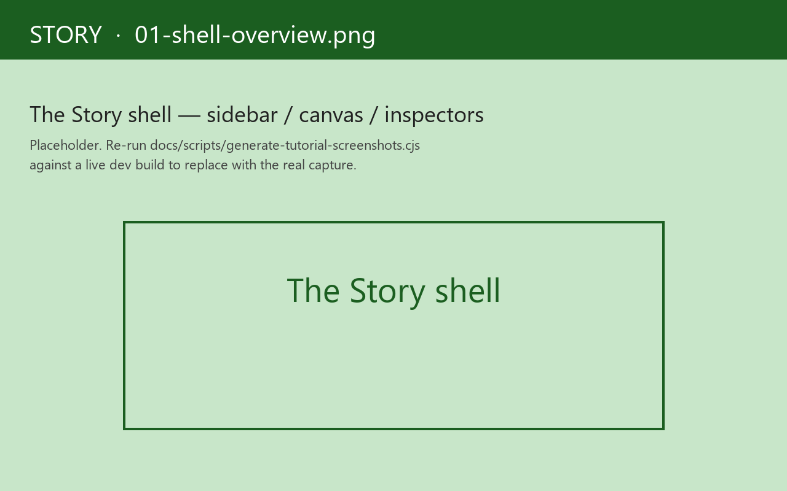

# Story

**Storybook, for frames.**

Story is the component playground for re-frame2 apps. You catalogue every state a component can be in — empty, loading, error, loaded, the dropdown-open, the disabled, the impersonating — and render them all side-by-side. Forms. Dropdowns. Cards. Whatever component you'd reach for Storybook to drive, you'd reach for Story.

Where Storybook is a separate runtime running outside your app, Story is *the same runtime, allocated differently*. Each variant runs in its own re-frame2 frame ([Guide 06a — Frames](../guide/06a-frames.md) is the dedicated chapter). Each variant body is plain data, not a function (no `Counter.story.tsx` with inline JSX). Args resolve through a three-layer chain. Assertions ride the same `dispatch` pipeline as production events. Time-travel scrubs through `restore-epoch`. When you scaffold a new component, you're not reaching for a separate `.stories.tsx` file — you're declaring `reg-story` and `reg-variant` against the same component you're shipping.



## A scenario, before the tour

You're building a login form. There's an empty state, a loading state, an error state, an impersonating-as-admin state, and a "first-login welcome" state.

The old loop: render the form, click around, screenshot, repeat. To compare empty against error you'd refresh the whole page. To compare error against loaded you'd refresh again. Five states, five refresh cycles per change.

The Story loop:

1. Open `#/stories` in your dev build.
2. Click each state in the left sidebar. The canvas swaps in 30ms.
3. Open a workspace that mounts all five side-by-side; design review against the grid.
4. Switch to *Test* mode; every variant's `:play` assertions run automatically; the sidebar dots flip green.
5. Click *Test Codegen* on the canvas; tap through the form once; out comes an EDN `:play` body that exactly captures your interaction. Paste it into the variant.
6. Ship.

Storybook 9 has roughly the same loop; Story's differentiators are *EDN-first* (variants round-trip through MCP, visual-regression services, the agent input pipeline), *schema-derived controls* (no `argTypes` plumbing), *frame-per-variant isolation* (no state leaks), and *test-mode parity with Vitest* — every variant with a `:test` tag has a runnable assertion bundle.

!!! tip "Run the scenario yourself"

    The five-state login flow above is a runnable testbed at [`tools/story/testbeds/login_form/`](https://github.com/day8/re-frame2/tree/main/tools/story/testbeds/login_form). Clone the repo, run `npm run test:examples` from `implementation/`, then open `http://127.0.0.1:8030/login-form/#/stories`. The sidebar lists five variants — `/idle`, `/submitting`, `/error`, `/submitting-retry`, `/authenticated` — and a workspace that mounts all five side-by-side. Click each variant; the canvas swaps in 30ms. Switch to *Test* mode; the assertion dots flip green. Every contract this tutorial mentions (frame-per-variant isolation, `force-fx-stub`, three-layer args, EDN-first variant bodies, `:rf.assert/*` shapes) is exercised on the same testbed.

The chapters:

- [1. Your first story](01-first-story.md) — `reg-story`, `reg-variant`, schema-derived controls.
- [2. Mode tabs](02-mode-tabs.md) — Canvas / Docs / Tests / viewport / a11y / locale.
- [3. Recorder + Test Codegen](03-recorder-codegen.md) — the hero feature; record interactions, get `:play` bodies.
- [4. Workspaces + args editor](04-workspaces.md) — multiple variants on one page; live arg overrides.
- [5. Snapshot identity + QR sharing](05-snapshot-identity.md) — content-hashed snapshots; share a layout state via QR.
- [6. Time-travel in Story](06-time-travel.md) — Causa embedded in the RHS, scoped per variant.
- [7. Multi-substrate side-by-side](07-multi-substrate.md) — render the same variant under Reagent, UIx, Helix.

## Three load-bearing rules

Before the chapters, three contracts:

1. **Each variant runs in its own frame.** Fresh `app-db`, fresh queue, fresh sub-cache. State doesn't leak between scenarios. What you see is what production would render against the same fixture.
2. **Variant bodies are data — never functions.** A variant body is a map with `:events`, `:args`, `:decorators`, `:play`, etc. Every slot is plain EDN, round-trippable across the network. This is the lock that lets MCP, visual-regression services, and agent input pipelines all consume the same shape.
3. **Assertions record, don't throw.** A failing `:rf.assert/path-equals` doesn't blow up the variant — it appends an entry to the variant frame's assertion accumulator. The play sequence runs to completion either way; the test runner asks "did every entry pass?" at the end.

Most of Story's distinctive properties — the test-mode reporter, the snapshot identity, the MCP write surface — are downstream of those three rules.

## Where to install

Story lives at [`tools/story/`](https://github.com/day8/re-frame2/tree/main/tools/story) under coord `day8/re-frame2-story`. While re-frame2 is in alpha, vendor through a checkout:

```clojure
;; deps.edn — Story should be a dev-shape dep; production builds DCE it.
{:aliases
 {:dev
  {:extra-deps {day8/re-frame2-story {:local/root "tools/story"}}}}}
```

In your app's entry namespace:

```clojure
(:require [re-frame.story :as story]
          [my-app.stories])    ; loads the registrations

(defn run []
  (rf/init! reagent-adapter/adapter)
  (story/install-canonical-vocabulary!)
  ;; ... normal app boot ...
  (when (= "#/stories" js/window.location.hash)
    (story/mount-shell! (js/document.getElementById "app"))))
```

`install-canonical-vocabulary!` registers the seven canonical tags, the lifecycle machine, the seven `:rf.assert/*` handlers, the built-in `force-fx-stub` decorator, and the v1.0 panel set. Idempotent. Production builds — where `re-frame.story.config/enabled?` is `false` via `:closure-defines` — short-circuit at registration time, and `mount-shell!` short-circuits before any DOM call.

The shell is a three-pane Reagent component: a **left sidebar** (stories tree + tag filter + workspaces), the **main pane** (selected variant's canvas or selected workspace), and a **right panel** — Causa embedded as the primary inspector, plus controls, the dispatch console, play status, and any project-custom `reg-story-panel` placements (rf2-sgdd3).

Ready? Start at [your first story](01-first-story.md).
