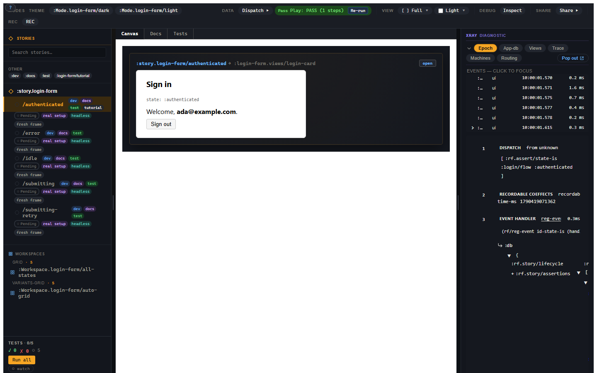

# Story

You have a view with more states than you can comfortably reach by clicking
through the app. Story gives those states names, renders them in isolated
frames, lets you poke their inputs, and then lets the same artifact become
documentation, a test, a shareable repro, or an agent-readable target. This is
the Storybook-shaped idea, but built on re-frame2's frames, event pipeline,
schemas, trace bus, and Xray.



## The short version

Story is a workshop for application states.

In Storybook, a story is usually a render function plus args. In Story, a
variant is data:

```clojure
(story/reg-variant :story.login/error
  {:setup [[:login/flow [:login/submit {:email "ada@example.com"
                                         :password "wrong"}]]
           [:login/flow [:login/failure
                         {:failure {:status 401
                                    :message "Invalid credentials."}}]]]
   :script [[:dispatch-sync [:rf.assert/state-is :login/flow :error]]]
   :tags #{:dev :docs :test}})
```

That data is enough to:

- allocate a fresh frame;
- run setup events through your real handlers;
- render the live app view;
- run assertions;
- show evidence in Story and Xray;
- export a URL, EDN snippet, screenshot, or static build;
- let Story-MCP run the same variant from an agent.

The word to remember is **variant**. A variant is a named application state,
not a second implementation of the view. The view remains your real view. The
handlers remain your real handlers. Story supplies the workshop around them.

## What makes Story different

Story is familiar: sidebar, canvas, controls, docs, tests, sharing.
If you know Storybook, you should not need a ceremonial robe and a map of the
catacombs to get started. The interesting parts are where re-frame2's substrate
lets Story do more.

**Every variant runs in its own frame.** The login error state and the login
authenticated state do not share `app-db`, event queues, subscriptions, or trace
records. Side-by-side states are actually side-by-side, not one global app being
cleverly repainted.

**Variant bodies are data.** `:setup`, `:script`, `:args`, `:decorators`, and
`:sub-overrides` are EDN-shaped. Function-valued hooks live behind registered
ids. This is why a variant can be copied, hashed, shared, recorded, tested, and
driven over MCP without inventing a parallel encoding.

**A visible state can also be a test.** Story's assertions record results
instead of throwing at the first failure. Test mode, `story/run`, `story/is`,
and the sidebar status all read the same run result.

**Evidence is shared with Xray.** Story owns the example, the script, the test
result, the docs page, and the narrative around the run. Xray owns the deep
runtime panels: epochs, app-db, views, trace, machines, and routing. Story
embeds Xray instead of growing a second debugger.

## The running example

This tutorial uses the shipped `login_form` Story testbed. It is small: a login
form with five states.

- idle;
- submitting;
- server error;
- retry submitting;
- authenticated.

That is enough to teach real setup events, network stubbing, workspaces,
schema-derived args, Test mode, Docs mode, Xray, sharing, and the MCP loop. It
is also small enough that you can keep the whole thing in your head, which is a
quality every tutorial example should aspire to before it starts wearing a hat
and calling itself architecture.

The bigger visual showcase, `nine_states`, appears when we talk about state
matrices. It is the "put every awkward UI state on one screen" example.

## Install Story

For a new app, the template can wire Story into the dev build:

```bash
clojure -Tnew create \
  :template io.github.day8/re-frame2-template \
  :name acme/my-app \
  :include-story? true
```

For an existing checkout during alpha, use the local tool:

```clojure
;; deps.edn
{:aliases
 {:dev
  {:extra-deps {day8/re-frame2-story {:local/root "tools/story"}}}}}
```

Then require your stories namespace from your dev entry point and mount the
shell on the Story route:

```clojure
(ns my-app.core
  (:require [re-frame.core :as rf]
            [re-frame.story :as story]
            [my-app.adapters.reagent :as reagent-adapter]
            [my-app.stories]))

(defn run []
  (rf/init! reagent-adapter/adapter)
  (when (= "#/stories" js/window.location.hash)
    (story/mount-shell! (js/document.getElementById "app") {})))
```

Loading `my-app.stories` fires the `reg-*` calls. The first registration
auto-installs Story's canonical tags, assertion events, built-in decorators,
and shell vocabulary. Production builds short-circuit Story registration and
mounting when Story is disabled through the config define.

## Vocabulary used in this tutorial

`reg-story` names the parent grouping and view id. It is where common args,
tags, and decorators usually live.

`reg-variant` names one state of that story. It has `:setup` events,
`:script` steps, args, expectations, and metadata.

`reg-workspace` arranges variants together, usually as a grid.

`reg-mode` creates toolbar-wide arg tuples such as light/dark theme or locale.

`story/run`, `story/is`, and `story/explain` are the three programmatic verbs.
They run a registered variant or an inline plan, report through the test
framework, or show how the final plan was assembled.

The tutorial teaches the public `:setup` and `:script` vocabulary. Some
recorder and internal surfaces still mention the older `:play-script` spelling;
the registrar lowers that shape while the tree finishes the pre-alpha rename.

## Chapters

1. [Your first variant](01-first-variant.md) - register and render a login state.
2. [Every state, side by side](02-every-state-side-by-side.md) - build a grid of states and use Story as a review surface.
3. [The fidelity ladder](03-fidelity-ladder.md) - know whether a state was reached honestly or painted cheaply.
4. [The variant is a test](04-the-variant-is-a-test.md) - run variants from Test mode and unit tests.
5. [The recorder, and cannot-run](05-recorder-and-cannot-run.md) - record scripts and understand honest refusal.
6. [Xray, earned at failure](06-xray-earned-at-failure.md) - move from a failed expectation to runtime evidence.
7. [Workspaces, modes, composition](07-workspaces-modes-composition.md) - reuse context without hiding behaviour.
8. [Snapshot identity and sharing](08-snapshot-identity-and-sharing.md) - share reproducible states and stable visual keys.
9. [Multi-substrate and the agent loop](09-multi-substrate-and-agent-loop.md) - understand renderer choice and Story-MCP.

The [API reference](api/index.md) is the lookup track. Read the tutorial first
if Story is new to you; use the reference when you already know which surface
you need.
