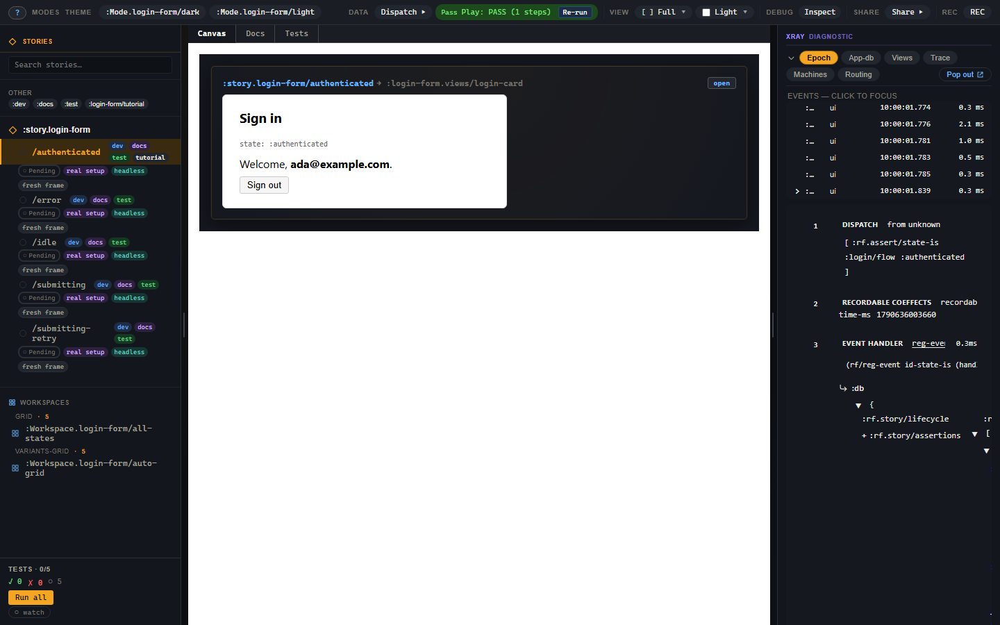

# Story

Story lets you keep a UI state or interaction as a named variant. Open it on
a canvas, change its inputs, compare it with other states, and run its
assertions in your test suite. Each variant runs in its own re-frame2 frame,
using your application's registered events, subscriptions and views.

For example, a login form needs an empty state, a pending request, a rejected
password, a retry and a successful sign-in. Story keeps those states available
without repeatedly clicking through the application.

A story groups variants of a view. A variant declares the setup that reaches
one state and, when needed, a script and assertions. A workspace displays
several variants together. The examples in this guide use the shipped
`login_form` testbed throughout.

## Story, tests and Xray

Story supplies the reproducible scenario. Its assertions supply the test:
the shell's **Tests** tab and `rf.story/is` execute the same registration.
Xray supplies the runtime evidence behind the result. A failed assertion can
take you from Story's Evidence panel to the event, state change or machine
transition in Xray, then back to the same scenario after a fix.

## When to use another tool

Use ordinary unit tests for pure functions or an isolated event handler.
Use browser tests when you need the complete application's navigation or
browser integration. Story is useful when a state also deserves a name,
a visible example or a reusable reproduction.

Story does not compare pixels; an external screenshot tool can use its
snapshot identity to manage captures. Its canvases share the host page's CSS,
focus and portals. Use an iframe-based preview tool when stylesheet isolation
is the thing you need to verify.

## Install Story

A generated app already has development wiring. For an existing app,
[the installation recipe](installation.md) adds the development dependency
and mounts the shell.
