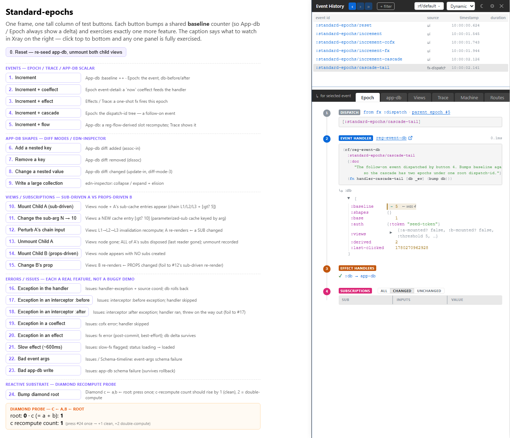

# 1. Installation

You want Xray in a dev build without teaching production about it. This chapter gives you the smallest honest setup: add the dev dependency, reserve the right-side host, wire the preload, and check that the panel opens.

## Add The Dev Dependency

While re-frame2 is pre-alpha, use a checkout-local dependency from a dev alias:

```clojure
;; deps.edn
{:aliases
 {:dev
  {:extra-deps
   {day8/re-frame2-xray {:local/root "tools/xray"}}}}}
```

When Xray is published, this becomes a normal Maven coordinate. Keep it in a dev-only alias. Xray is a tool, not application code.

## Reserve The Host

Xray's normal launch mode is a true inline right rail. Your page owns the layout. Xray owns the content inside the host.

```html
<div class="app-shell">
  <main id="app"></main>
  <aside data-rf-xray-host></aside>
</div>
```

```css
:root { --rf-xray-accent: #7c5cff; }

.app-shell {
  display: flex;
  min-height: 100vh;
}

#app {
  flex: 1;
  min-width: 0;
}

[data-rf-xray-host] {
  flex: 0 0 var(--rf-xray-inline-width, 560px);
  min-width: 320px;
  box-sizing: border-box;
  border-left: 1px solid #2a2a2a;
}
```

The CSS variable sets the initial width. Xray adds its own drag handle, persists the user-chosen width, and yields if you deliberately put native `resize:` behavior on the host.

If your layout cannot use `[data-rf-xray-host]`, configure another selector before `rf/init!`:

```clojure
(require '[day8.re-frame2-xray.config :as xray-config])

(xray-config/configure!
  {:rf.xray/layout-host-selector "#devtools-xray"})
```

## Wire The Preload

For a Shadow CLJS browser build:

```clojure
;; shadow-cljs.edn
{:builds
 {:app
  {:devtools
   {:preloads [day8.re-frame2-xray.preload]}}}}
```

The preload registers Xray's trace and epoch collectors, installs the browser API, installs the `Ctrl+Shift+C` keybinding, and auto-opens into the layout host after the re-frame2 substrate adapter is ready.

You do not need to call `init!` when the preload is wired. `day8.re-frame2-xray.core/init!` exists for manual hosts and unusual embedding setups.

## Launch And Close

In a normal dev page, Xray opens automatically once the app starts. The everyday controls are:

| Action | How |
|---|---|
| Hide or show Xray | `Ctrl+Shift+C` |
| Close from the shell | the close icon in the ribbon |
| Open from code | `(day8.re-frame2-xray.core/open!)` |
| Toggle from code | `(day8.re-frame2-xray.core/toggle!)` |
| Pop out to a second same-origin window | `(day8.re-frame2-xray.core/popout!)` |

Tool-owned pages can suppress only the automatic page-load open:

```clojure
(xray-config/configure! {:rf.xray/auto-open? false})
```

That does not disable Xray. Explicit `open!`, `toggle!`, and the keybinding still work.

## Check It

From this repository, the smallest useful Xray driving surface is the standard-epochs testbed:

```powershell
cd implementation
npx shadow-cljs watch :examples/standard-epochs
```

Open `http://localhost:8031`. Click a few numbered buttons on the left. Xray should be visible on the right, and the event spine should fill with rows.



If Xray does not appear, check:

- The host element exists in the page.
- The preload is on the dev build, not the release build.
- `rf/init!` has run with a substrate adapter.
- `window.day8.re_frame2_xray.status()` has no missing-host diagnostic.

## Production Posture

Production builds should not include the preload. Even if a dev-only path accidentally remains reachable, Xray's substrate is gated by re-frame2's debug flag and the bundle-isolation checks guard against Xray strings leaking into production bundles.

The practical rule is simple: put Xray in dev build config, not app code.
