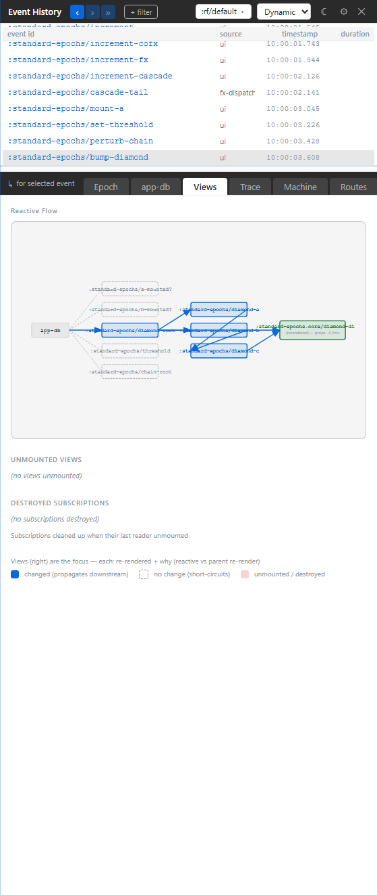

# 2. Panel Tour

You opened Xray and now you need orientation. This chapter teaches the shell as a working debugger: where the timeline lives, what the six Dynamic tabs answer, when Static mode is better, and which panel to open first.

## The Shape Of The Shell

Xray's Dynamic shell has four layers:

```text
L1  ribbon       mode, frame, filters, settings, close
L2  event spine  recent epochs for the selected frame
L3  tabs         Epoch, app-db, Views, Trace, Machine, Routes
L4  detail       the selected tab's view of the focused epoch
```

The event spine is the load-bearing piece. It is not a decorative timeline; it is the focus selector for the entire tool. Click an event row and every tab reads that same epoch.


## The Ribbon

The ribbon is for scope, not diagnosis.

- **Mode** switches Dynamic and Static.
- **Frame** chooses which re-frame2 frame you are observing.
- **Filters** hide or show event rows by event id.
- **Settings** controls theme, density, sensitive-value posture, and related shell behavior.
- **Close** hides the panel without tearing down the mounted tree.

Frame selection matters in real apps. If your page has multiple isolated frames, the same event id can mean different state and different epoch history in each frame. Pick the frame first, then debug.

## The Event Spine

The spine lists recent epochs for the selected frame. New rows arrive while Xray is following the live head. Clicking an older row puts you into a historical focus: the app can keep running, but the detail panels remain pointed at the row you chose until you follow the head again.

Use the spine when you know the symptom just happened and you want to answer: "Which event caused it?"

## The Six Dynamic Tabs

### Epoch

Open Epoch first. It is the readable version of the cascade: dispatch, coeffects, interceptors, handler, app-db change, effects, subscriptions, views, schema checks, and issues where they occurred.

This is the tab for "explain the whole thing to me without making me reconstruct it from raw rows."

### app-db

Open app-db when the question is state. The panel starts with changed slices for the focused epoch. It is read-only and path-oriented: good for seeing what changed, where it changed, and whether the state you expected is actually present.

### Views

Open Views when the page looks wrong or slow. It shows the reactive side of the cascade: subscriptions and renders, with enough structure to see whether a view changed because a subscription changed, because props changed, or because the view was mounted or unmounted.



### Trace

Open Trace when the friendly view is hiding too much. Trace is the flat, epoch-scoped feed of runtime records. It is excellent when you need exact ordering, exact operation names, source coordinates, durations, or a payload that was summarized elsewhere.

### Machine

Open Machine when the focused event touched a state machine. Dynamic Machine is event-coupled: it shows what this epoch did to the affected machine. If you want to browse all machine definitions, use Static mode.

### Routes

Open Routes when navigation is the problem. The Dynamic Routes tab explains the focused epoch's route activity; the Static Routes tab is for browsing the registered route table and simulating how URLs rank.

## Static Mode

Static mode removes the event spine. That is the point. You are no longer asking what one event did; you are browsing the app's registered structure.

Static tabs:

- **Machines**: registered machines and their topology.
- **Routes**: route catalogue and URL simulation.
- **Schemas**: registered app-db, event, sub, and related schemas.
- **Flows**: registered flows and their inputs.
- **Interceptors**: registered event chains and shared interceptors.

Use Static mode before a debugging session when you want the map. Use Dynamic mode during the debugging session when you want the journey.

## The Daily Path

Most debugging sessions are pleasantly boring:

1. Pick the frame.
2. Click the event row.
3. Read Epoch.
4. Check app-db or Views depending on whether the symptom is state or rendering.
5. Drop to Trace only if you need the raw record.

That is the whole tool in its everyday form.
