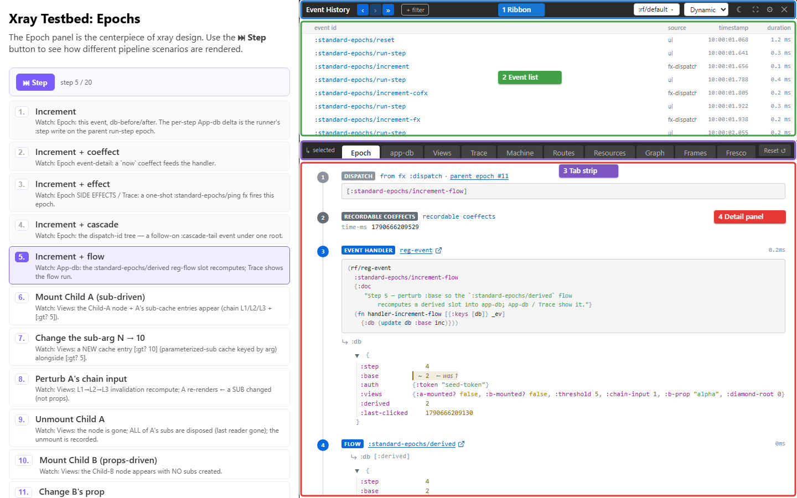

# Choose a panel

Start with the question you are trying to answer. Most sessions need **Epoch**,
then **app-db** or **Views**. Open the other panels when those leave a specific
question unanswered.

## The shape of the shell

Choose the inspected **frame** in the ribbon (1), an event in the list (2),
and a tab (3). Each frame has its own state and history. Xray's own frame is
excluded from the picker.

The event list is headed **Event History**. A row shows an event id, dispatch
source, time and handler duration; hover for the full vector. An error or
warning gives the row a pink background. A source such as `fx-dispatch`,
`http` or `router` identifies the runtime operation that dispatched it.

## Dynamic panels

| Question | Panel | What time does it show? |
| --- | --- | --- |
| What happened during this event? | **Epoch** | Selected epoch |
| Which values changed? | **app-db** | State after the selected epoch |
| What recomputed or rendered? | **Views** | Selected epoch |
| What are the exact operations and payloads? | **Trace** | Selected epoch; retained outside-event traces for an ungrouped row |
| Which guard, action or transition ran? | **Machine** | Selected epoch |
| Why did navigation succeed or fail? | **Routes** | Selected epoch's navigation, plus the current route |
| Why is data stale, loading or retained? | **Resources** | Current resource state and retained activity |
| What feeds this derived value? | **Graph** | Registered structure or current live dependencies |
| Which registrations does this frame resolve? | **Frames** | Current frame images |
| Why is this Fresco view busy? | **Fresco** | Current read sets and retained activity; Causal uses the selected event |

**Frames** lists each frame's images, descriptor kinds and counts, required
capabilities, and a preview of `[kind id]` descriptors with their source.
If the same event id behaves differently in two frames, compare their images
and registrations before comparing state.

The `:panel` ids used by a host's `focus!` call are in the
[API reference](api/reference.md#the-dynamic-tabs). Some ids differ from the
visible labels: **Machine** is `:machines`, and **Routes** is `:routing`.

## Static panels

Switch **Mode** to **Static** to browse registrations. The event list disappears.

| Panel | Use it to inspect |
| --- | --- |
| **Machines** | Definitions, topology and a simulator that leaves the app unchanged |
| **Routes** | Registered paths and which route a URL would match |
| **Schemas** | Frame app-db schemas and registered event and subscription schemas |
| **Flows** | Inputs and the app-db path each registered flow writes |
| **Interceptors** | Event chains and shared interceptors, including how many chains use each |

Search a catalogue by id or its displayed description, expand the relevant
registration, and follow its source link. Switch back to Dynamic mode when
you need evidence from an actual run.

## Everyday controls

| Action | Control |
| --- | --- |
| Show or hide Xray | **Ctrl+Shift+C**, or **✕** to hide |
| Step to the previous / next event | **‹** / **›**, or `j` / `k` |
| Follow the newest event | **»**, `l`, or **Shift+G** |
| Pause / resume following | **Space** |
| Switch Dynamic / Static | **Ctrl+Shift+M**; **⌘⇧M** on macOS |
| Search commands, panels, events and frames | **Ctrl+K**; **⌘K** on macOS |
| Open Settings | **⚙**, `,`, or `s` |
| Use a second window | **⛶** |
| Change light / dark theme | **☾** / **☀** |

Single-letter keys work while focus is inside Xray and outside text inputs.
Letters in panel tooltips, such as “Trace (t)”, are labels. They are not panel
shortcuts. Settings has its own `g`, `k`, `b` and `d` tab shortcuts.

Drag the event list's lower edge for more height, or Xray's left edge for
more width. If a popup is blocked, allow popups for the development origin
or keep the panel inline. An app that needs those keyboard chords can disable
**Handle keys?** in Settings → Keybindings.
