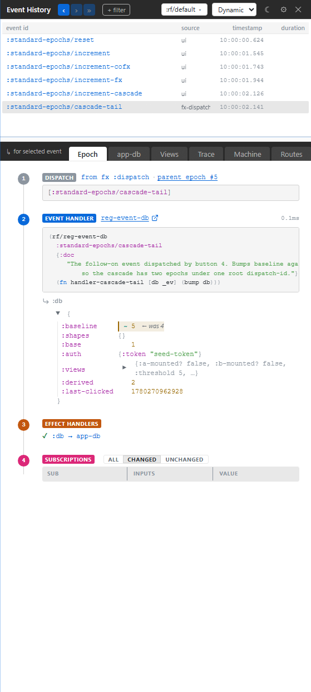

# 3. Time-Travel Scrubbing

You need to look backward without losing the live app. This chapter explains Xray's current time-travel model: the event spine is the scrubber, a focused past row is RETRO, and following the head returns you to LIVE.

## There Is No Bottom Rail

Older Xray drafts had a bottom time-travel rail. The shipped model is simpler: the event spine is the timeline.

Click an event row in the spine. Xray focuses that epoch. The detail panels now show the app-db diff, trace rows, views, machine transitions, and route activity for that selected epoch.

The app can continue running while you inspect the past. Xray stays on the selected row until you move focus or follow the head.

## LIVE And RETRO

Think of focus as having two postures:

- **LIVE**: Xray follows the newest epoch for the selected frame.
- **RETRO**: Xray is pinned to an older epoch.

You enter RETRO by clicking an older event row or stepping backward. You return to LIVE by following the head from the ribbon controls.

The important detail is that this is panel focus, not a magical fork of your app. The focused epoch is the record every tab reads. If you choose an older row, app-db, Views, Trace, Machine, and Routes all agree on that older row.

## Inspecting A Past Event

On the standard-epochs testbed:

1. Click buttons 1, 2, and 3.
2. Click the row for button 1 in Xray's event spine.
3. Open app-db. You see the state delta for button 1, not button 3.
4. Open Trace. You see the trace records for button 1's epoch.
5. Follow the head. The panels jump back to the newest epoch.

This is the heart of Xray: one historical selection drives every lens.

## Restore Versus Inspect

Inspecting a past epoch is read-only. It changes Xray's focus, not your app.

Rewinding the app is a stronger operation. The runtime can restore an epoch's canonical frame-state (`:frame-state-after`) into the target frame — app-db and runtime-db reinstalled together as one atomic frame-state, so machine snapshots and the route slice rewind alongside application state, not just the app-db partition. (The epoch record's `:db-before` / `:db-after` are optional app-db projections of that frame-state, not the restore target.) Restore is an explicit act — it changes the observed app. In day-to-day debugging, you usually inspect first. Restore only when you deliberately want to put the app back into that state.

The restore operation is a runtime primitive, not an Xray trick. Xray gives you the context; re-frame2 owns the state transition.

## Filters Keep The Spine Useful

Real apps produce noise. Xray's filter pills let you include or exclude event ids so the spine stays readable.

Good filter habits:

- Exclude high-volume housekeeping events when chasing a user action.
- Include only one feature namespace when debugging a focused flow.
- Clear filters before deciding an event did not happen.
- Remember that errors and issue-marked rows are designed to remain visible enough to find.

The goal is not to hide complexity forever. It is to remove unrelated motion long enough to read the cascade you care about.
