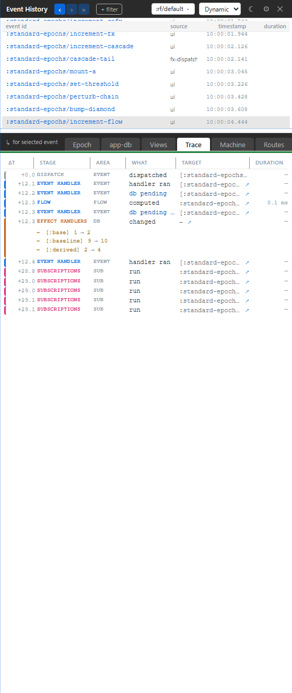

# 4. Trace Stream

You read the Epoch tab and still need the raw facts. This chapter explains the Trace tab: an epoch-scoped flat list of runtime records, useful for ordering, exact operation names, payloads, durations, source jumps, and cases where the friendly panels summarize too much.

## Epoch First, Trace Second

Start with Epoch because it is written for humans. It groups the cascade into meaningful phases.

Drop to Trace when you need:

- exact ordering of runtime operations;
- the original operation keyword;
- a precise payload;
- a duration row;
- source coordinates;
- a row that a friendlier panel compressed into a summary.

The Trace tab is not a punishment box. It is the same story at a lower level.



## What Trace Shows

Trace is scoped to the focused epoch. If the spine is focused on `:counter/inc`, Trace shows records from that cascade. Pick another event row and Trace rebinds.

Each row is shaped for scanning:

- **Time**: relative placement in the epoch.
- **Stage**: the same cascade phase vocabulary used by Epoch.
- **Area**: dispatch, coeffect, handler, db, fx, sub, view, machine, route, schema, or related runtime area.
- **What**: the operation that happened.
- **Target**: the event id, sub id, view id, path, fx id, machine id, or route id.
- **Duration**: present where the substrate has timing.

The left edge color follows the Epoch stage, so the raw list still has a story line.

## A Tiny Listener

Xray is the complete UI over the trace bus, but the bus is public substrate. A small tool can listen too:

```clojure
(require '[re-frame.core :as rf])

(defn install-mini-trace! []
  (rf/register-listener!
    :my-tool/trace-printer
    (fn [event]
      (js/console.log
        (pr-str (select-keys event [:operation :event :frame]))))))
```

That is the same architectural move Xray makes, just with a smaller presentation. Xray does more because it also reads epoch history, source coordinates, registries, frames, and panel-specific projections.

## Why The Trace Tab Stays Flat

Trace is not another nested dashboard. The nested explanation lives in Epoch. The flat feed is valuable precisely because it stays close to the wire.

When something looks suspicious in a friendly panel, Trace lets you answer:

- Did that operation really emit?
- Did it happen before or after the handler?
- Was the value elided or redacted?
- Which source coordinate emitted it?
- How many related records are in this epoch?

That is enough. If you need a higher-level explanation, go back to the lens that owns that domain.
