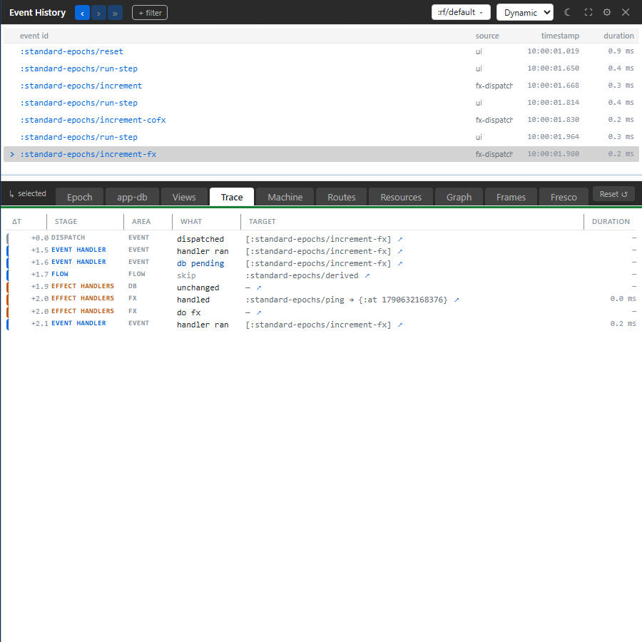

# Read the exact runtime records

Open **Trace** when Epoch leaves an ordering, payload or failure question
unanswered. Trace lists the selected epoch's records in emission order.

In the `standard-epochs` example, run **step 3**, select
`:standard-epochs/increment-fx`, and open Trace. The handler returns a
`:standard-epochs/ping` effect; the trace lets you check which effect actually
ran after the handler.

## Read a row

| Column | Meaning |
| --- | --- |
| **Δt** | Milliseconds since the epoch's first record |
| **Stage** (1) | Where the operation belongs: dispatch, coeffects, interceptors, handler, flows, effects, subscriptions or views |
| **Area** (2) | The runtime area: EVENT, COEFFECT, DB, FX, FLOW, SUB, VIEW, MACHINE, ROUTING, RESOURCE, EPOCH, ERROR or WARNING |
| **What** | The exact operation keyword |
| **Target** | The relevant event, sub, view, path, effect, machine or route |
| **Duration** | Recorded elapsed time, when available |

Click a row to expand its raw record; click again to collapse it. A state-write
row includes changed paths. The **↗** source link (3) opens the corresponding
code when its registration has a coordinate.

Read the operation and tags together. An effect's configured reply target
does not prove that the reply arrived. Its later reply event and trace do.
[Managed effects](managed-effects.md) shows how to follow that exchange.

## Cancellation cascades

Destroying a child actor can also abort its requests and timers. The destroy
row's **⟲** control, or its context menu, groups those records into a
cancellation cascade: the decision, teardown and aborted work, in order.
Click an entry to jump to its trace row; **Esc** closes the cascade view.

If a request vanished, check this evidence before adding a retry. Cancelling
work owned by a destroyed actor can be the expected outcome.

## Troubleshooting

| Symptom | Meaning | Action |
| --- | --- | --- |
| No records for an old row | Its epoch evidence was evicted or never settled | Select a retained completed event and reproduce if needed |
| An error happened outside an event | It belongs to the ungrouped bundle | Enable **Show :ungrouped pseudo-event-bundle events in L2** in General settings, then select `<no event>` |
| A payload has a redaction or size marker | Display classification withheld the value | Inspect its surrounding tags; see [local visibility](manage-evidence.md#redacted-and-large-values) |
| A row has no duration | That operation has no timing evidence | Do not treat the blank as zero |

Your own tests or tools can read the same runtime stream. The
[observability guide](../core/observability.md#write-a-listener) shows how to
register and remove a trace listener.
