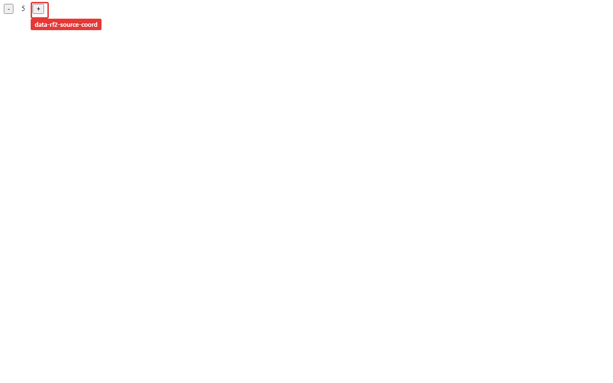

# 5. Click-To-Source

You found the bad row or the wrong DOM node. Now you want the source line, not a philosophical seminar. This chapter shows how Xray and re-frame2 source coordinates get you from runtime evidence back to code.

## Source Coordinates Everywhere Useful

In dev mode, re-frame2 stamps source coordinates onto registrations and rendered views. Xray consumes those coordinates in panels and turns them into editor links where possible.

You will see source chips on things like:

- event handlers;
- subscriptions;
- views;
- effects and coeffects;
- machine definitions;
- route registrations;
- schema registrations;
- trace rows with a known origin.

The shape is the same idea everywhere: namespace, symbol or id, line, and column.

## DOM Back To View

Rendered elements can carry `data-rf2-source-coord` in dev mode. That attribute points at the view code that produced the DOM.

In browser DevTools, inspect or copy an element and look for:

```html
<button data-rf2-source-coord="standard_epochs.core:control-button:412:4">
  ...
</button>
```

That is not for production. It is a dev-only bridge from pixels back to the view function.



## Xray Back To Editor

Xray's source chips use the configured editor protocol. The supported editor preferences live under the Xray config surface:

```clojure
(require '[day8.re-frame2-xray.core :as xray])

(xray/set-editor! :vscode)
;; or :cursor, :windsurf, :zed, :idea
```

Custom URI templates are also supported through the lower-level config namespace when a team has its own editor bridge.

For local testbeds and docs screenshots, the project root is seeded so Xray can turn a classpath-relative file into an absolute editor URI. In your app, configure that root when your build environment does not provide one.

## A Practical Loop

When a view is wrong:

1. Inspect the DOM node or open Xray's Views tab.
2. Follow the view source coordinate.
3. Check which subscriptions the view read.
4. Jump to the subscription source coordinate.
5. Open app-db or Trace for the focused epoch.

That loop is short because every hop is data-shaped. You are not searching the repository for a string you hope is unique; you are following the runtime's own registration facts.

## Privacy And Production

Source coordinates are dev-only. Production HTML does not carry `data-rf2-source-coord`, and production bundles should not include Xray.

Sensitive values are a separate concern. Xray follows the framework's redaction and elision rules when rendering runtime evidence. A source coordinate tells you where a value came from; it should not force the value itself to leak.
