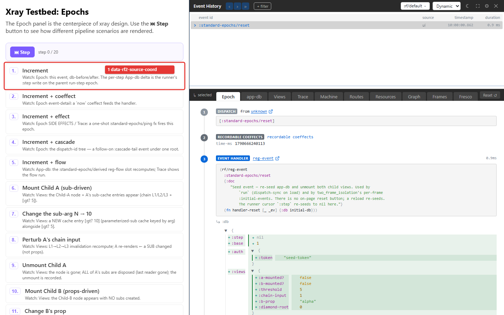

# Click-to-source

You have found the event, trace row or DOM element that looks wrong, and now you want the line of code behind it. re-frame2 records where each registration and view is defined, and Xray turns those source coordinates into links to your editor.

## Where source links appear

In dev mode, re-frame2 stamps source coordinates onto registrations and rendered views. Xray shows them as editor links on:

- event handlers;
- subscriptions;
- views;
- effects and coeffects;
- machine definitions;
- route registrations;
- schema registrations;
- trace rows with a known origin.

A registration records its coordinate as a map of `:ns`, `:file`, `:line` and `:column`. A rendered view carries the same facts packed into one string attribute, described next.

## From the DOM back to the view

In dev mode, each registered view's root element (1 in the screenshot below) carries `data-rf2-source-coord`, which points at the view code that produced it, and `data-rf-view`, which names the view. Only the root element carries them; the elements inside it do not.

In browser DevTools, inspect an element and look for the nearest ancestor carrying:

```html
<div data-rf2-source-coord="runner.core:step-row:310:1"
     data-rf-view=":runner.core/step-row">
  ...
</div>
```

The value is the namespace, the view's name, the line and the column.

Going the other way, hover a view in the Epoch or Views tab and Xray highlights that view's element on the page.

[](../images/xray/xray-tutorial-source-coord.png)

## From Xray to your editor

Xray renders each coordinate as a link. Its look varies by tab: in Epoch it is the registration kind, such as `reg-event`, followed by ↗, and in Trace it is a ↗ after the row's target. Clicking resolves the coordinate to your editor's URI scheme, such as `vscode://file/...`, `cursor://...` or `idea://open?...`, and hands it to the operating system so your editor opens the file at that line.

### Tell Xray which editor

Xray cannot detect your editor. Until you configure one, links use the default `:vscode` scheme, and if VS Code is not your editor the operating system has nothing to open them with. The browser cannot tell that the open failed, so instead of sending the click nowhere, an unconfigured click shows a **"No editor configured" hint**: a small toast in the bottom corner with an **Open Settings** button that goes to the editor picker. Once an editor is configured, clicks open the source directly and the hint no longer appears.

There are two ways to configure the editor:

- **Xray Settings, per developer.** The General tab's "Click-to-source links open in" picker. The choice is stored in `localStorage`, so each teammate picks their own editor on their own machine. The hint's Open Settings button lands here.
- **`configure!` at boot, as the project default.** Set it once in your app's boot code:

    ```clojure
    (require '[day8.re-frame2-xray.config :as xray-config])
    (xray-config/configure! {:rf.xray/editor :cursor})
    ;; :vscode (default) | :cursor | :windsurf | :zed | :idea | {:custom "<uri-template>"}
    ```

    The `{:custom "<uri-template>"}` form supports a team's own editor bridge via `{path}` / `{file}` / `{line}` / `{column}` placeholders.

The Settings picker overrides the `configure!` value on that machine only. A mixed-editor team sets a project default in code, and each developer overrides it locally without changing the shared default.

### What a click does

With an editor configured, a click first asks the page's dev server to open the file, by posting to `/__rf-open-in-editor`. The testbeds in this repository are served by a dev server that answers it. When no server answers, Xray hands the editor URI to the operating system. Each click logs that URI to the browser console, so when nothing opens you can see what was attempted. A `{:custom …}` template that produces a `javascript:`, `data:` or `vbscript:` URI is never opened.

### Relative coordinates and `:rf.xray/project-root`

`:rf.xray/project-root` is **only** for classpath-*relative* source coordinates. Editors resolve paths against the filesystem, so a relative path fails with "Path does not exist". When your stamped coordinates are relative, set the on-disk root and Xray prefixes it to build an absolute URI:

```clojure
(xray-config/configure! {:rf.xray/project-root "/abs/path/to/project/src"})
```

The normal `reg-*` / `reg-machine` registration path stamps **absolute** coordinates, which Xray uses as they are, so in the common case leave `:rf.xray/project-root` unset. Do not hardcode a machine-specific path "to make Open work"; if absolute coordinates already open, you do not need it.

## A practical loop

When a view is wrong:

1. Inspect the DOM node, or open Xray's Views tab.
2. Follow the view's source link.
3. Check which subscriptions the view read.
4. Jump to the subscription's source.
5. Open app-db or Trace for the focused epoch.

Each hop follows the runtime's own record of where things are registered, so you never have to search the repository for a string and hope it is unique.

## Privacy and production

In a production build, a registration's metadata carries no source coordinate, and the HTML carries no `data-rf2-source-coord` or `data-rf-view`. The runtime keeps each registration's `:ns`, `:file` and `:line` for one purpose only, so that error reports can still name where a handler lives. Production bundles should not include Xray.

Source links never show values. Values are rendered under the framework's redaction and elision rules, so a link can tell you where a sensitive value came from without showing the value.

## Troubleshooting

| Symptom | Cause | Fix |
| --- | --- | --- |
| “No editor configured” | No project or local editor choice was made | Choose the editor in Settings → General |
| The wrong editor opens | A local override wins over the project default | Choose **(project default)** or reset the override |
| The editor reports a missing file | A relative coordinate was resolved against the wrong root | Check the logged URI; set project-root only for relative coordinates |
| There is no source link | The registration has no usable file coordinate, or this is a production build | Check the dev registration and follow the handler id in your editor |
| DOM inspection finds no attribute on the selected element | Coordinates live on the registered view's root | Inspect the nearest ancestor with `data-rf2-source-coord` |
