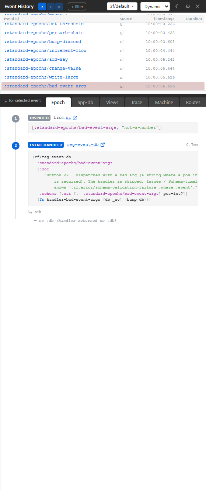

# 6. Schema-Violation Timeline

Your app emitted a schema violation. This chapter shows where it appears in current Xray: not in a separate Issues tab, but inline at the event that caused it, with the trace record still available when you need exact details.

## The Old Issues Tab Is Gone

Earlier Xray material described a dedicated Issues tab. That is out of date.

Current Xray surfaces issues in three places:

- the event row is visually marked when the epoch has an issue;
- the Epoch panel shows the failing step in context;
- the Trace tab contains the underlying trace record.

This is a better debugging posture. A schema violation is not a floating notification; it is part of the cascade that produced it.

## What A Schema Failure Tells You

Schema validation failures identify the boundary that failed. Depending on the surface, that can be:

- event arguments;
- app-db after a handler;
- coeffect data;
- effect arguments;
- subscription return values.

The exact payload lives in the trace record. The useful human question usually lives one level up: which event caused the failure, which step was being validated, and did app-db roll back?

## A Small Example

The standard-epochs testbed includes buttons that deliberately cross invalid schema boundaries. Trigger one and Xray marks the epoch. Open Epoch to see where the cascade failed. Open Trace if you need the raw validation record.

## Why This Matters For Tests

Schema violations should be treated as failures. A final app-db assertion can miss a bug if the runtime rolled back the invalid write and the state looks clean afterward. Xray keeps the violation attached to the epoch so the hidden failure remains visible.

That is the same reason the testing substrate treats schema violations as first-class evidence. The state may recover. The fact that the invalid boundary was crossed still matters.

## Static Schemas

Use Static mode's Schemas tab when you want to browse what is registered. That is a different question from "which event violated a schema just now?"

- Dynamic Epoch answers: "where did this failure occur?"
- Dynamic Trace answers: "what was the exact emitted record?"
- Static Schemas answers: "what schemas exist in this app?"
