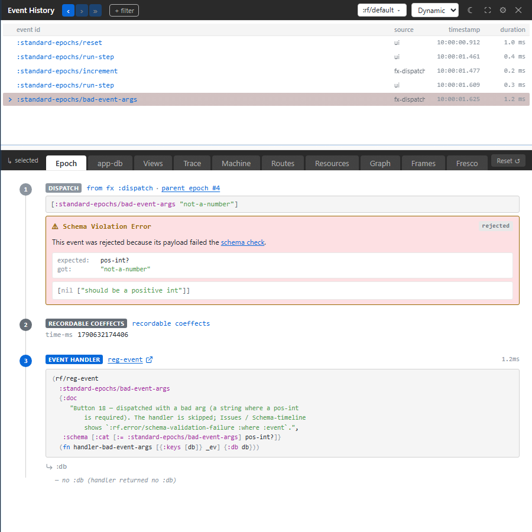

# Diagnose a schema violation

A handler or derived value failed a schema check. Xray marks the event and
puts the failure beside the operation that produced it. Check the failure
before trusting the final state: an invalid candidate write may have been
rejected, leaving apparently valid state behind.

## Reproduce an invalid argument

In the `standard-epochs` example, run **step 18: Bad event args**. It dispatches
`[:standard-epochs/bad-event-args "not-a-number"]` against a positive-integer
argument schema. Select that row and open **Epoch**.

Read the **expected** and **got** values in the block (2), then the recovery
chip (3). The handler never ran. Follow **schema check** to the registration
that declared the schema, and fix the argument or the declaration according
to the intended input.

## Compare an invalid write

Run **step 19: Bad app-db write**. The handler produces a value that fails
the app-db schema. This time the failure appears at the state write and
the candidate is rejected. Open **app-db**: the invalid value did not install.
The error still matters even though the retained app-db is valid.

The error id is `:rf.error/schema-validation-failure`. Its `:where` tag
identifies what was checked; its recovery tells you what actually happened.
For example, invalid event arguments skip the handler, invalid effect
arguments skip that effect, and an invalid subscription result becomes `nil`.
Flow-output and machine-completion checks can report a failure without
reversing the completed work. The
[schema recovery table](api/diagnostics.md#schema-validation) lists every
supported boundary and the machine-data phase differences.

## Violations in tests

A final-state assertion alone can miss a rejected write. Inspect the run's
failure evidence too. Story includes schema violations in its verdict;
an unconsumed violation prevents a pass. Declare
`:rf.assert/schema-error` only when the scenario is specifically testing
that rejection, with a matcher narrow enough to identify the intended
failure. The [Story failure walkthrough](../story/06-xray-earned-at-failure.md#schema-failures)
shows this pattern.

## Troubleshooting

| Symptom | Check | Action |
| --- | --- | --- |
| The handler appears never to run | `:where :event` and rejected chip | Fix the event arguments |
| State looks unchanged after a handler ran | App-db or machine-data validation rejected a candidate | Read the invalid candidate in Epoch, not just the installed state |
| A subscription unexpectedly returns `nil` | `:sub-return` or `:sub-override` failure | Fix the returned value or the test override |
| A violation disappears in a release build | Most schema checks are development checks | Keep assertions in tests; use `:boundary? true` where event validation must remain in production |
| A recorded coeffect stops an event | `:rf.error/cofx-value-invalid` | Supply a value matching the coeffect's schema; this check runs in every build |

Static → **Schemas** browses the declared schemas. It answers what is
registered; Dynamic → Epoch or Trace answers what failed in a run.
