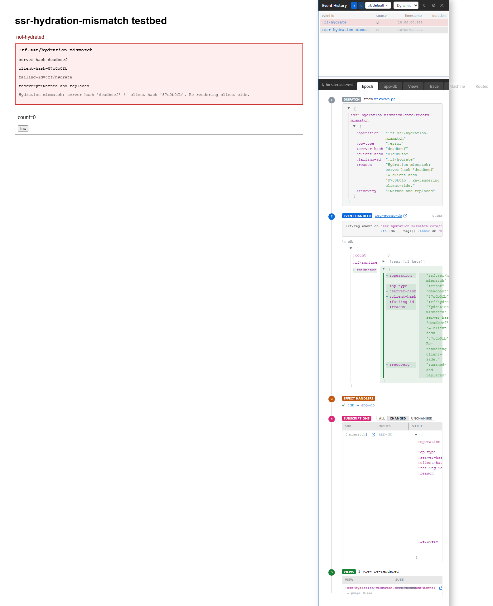

# 7. Hydration Debugger

You server-rendered a page and the client disagreed. This chapter explains how Xray helps with hydration mismatches: it treats them as runtime evidence, ties them to the relevant epoch, and helps you locate the first meaningful divergence.

## The Problem

SSR bugs are unpleasant because the symptom is visual but the cause can live in several places:

- server app-db seed;
- client hydration payload;
- route params;
- locale, time, random values, or browser-only coeffects;
- a view that reads from the world during render;
- a schema or data-classification mismatch across the wire.

Xray's job is not to make SSR magical. It gives you the evidence in the same place you already debug client cascades.

## Where Hydration Appears

Hydration diagnostics surface as issue evidence on the relevant epoch. Use the same loop:

1. Find the marked event row.
2. Open Epoch for the high-level failure and recovery.
3. Open Trace for the raw SSR or hydration record.
4. Use source coordinates to jump to the view or route involved.

If the mismatch has a render-tree diff, Xray shows the server and client sides around the divergent path rather than making you compare entire HTML strings.

## What To Look For

The common causes are boring, which is good news:

- A view used `js/Date`, random, or browser state during render.
- Server and client seeded different app-db values.
- The route matched differently on the client.
- A subscription returned `nil` on the server and real data on the client.
- A classified value was redacted or elided before one side expected it.

Fix the source of nondeterminism. Do not patch the rendered HTML after the fact.

## Xray And The SSR Rule

The SSR rule is the same rule the guide teaches for client views: render is a function of state. If the server and client have the same state and the view is deterministic, hydration has a chance. If not, React is left trying to reconcile two different stories.

Xray helps by showing the story re-frame2 saw: the hydrate event, the payload shape, the route or view evidence, and the mismatch record.
