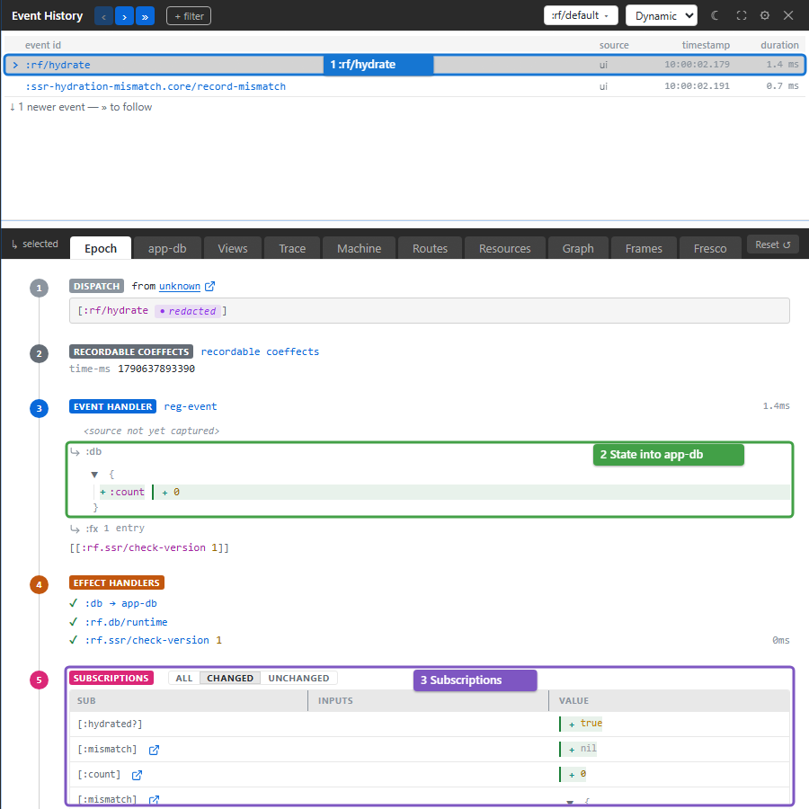

# SSR hydration

Your page was rendered on the server and now hydrates in the browser. Xray shows the hydration event itself, and keeps a hydration mismatch in its event list, where the Trace tab reads its details. This chapter says where to find it, and where else it is reported. [When the renders disagree](../ssr/concepts.md#when-the-renders-disagree) in the SSR guide explains how a mismatch is detected and what the runtime does about it.

## The hydrate epoch

Hydration is an ordinary event. The client dispatches `:rf/hydrate`, which installs the server's state into app-db, and Xray lists it in the event list like any other event (1 in the screenshot). Its Epoch tab shows the state landing in app-db (2), the effects it ran, and the subscriptions that computed their first values (3). The app-db tab shows the state the client's first render reads.

## Where a mismatch is reported

A hydration mismatch is not an event, and it belongs to no epoch. The client checks for it after its first render, outside any event.

Xray keeps it in the event list's `:ungrouped` row, which collects every trace fired outside an event. That row is hidden by default. Turn on **Show :ungrouped pseudo-event-bundle events in L2** in Settings → General, and a `<no event>` row appears, washed pink because it holds an error.

Select that row and open the Trace tab, which lists the row's traces. The `:rf.ssr/hydration-mismatch` row names the server's and the client's render hashes in its reason. Click it to open the whole trace: the hashes are its `:server-hash` and `:client-hash` tags, beside the frame, the `:failing-id` and the recovery the runtime took. The Epoch tab says "The selected event settled no epoch.", because no epoch settled.

Outside Xray, the details go to:

- trace listeners, as that same trace, carrying the same tags. [Write a listener](../core/observability.md#write-a-listener) in the observability guide shows how to register one.
- the frame's `:observability :errors` sinks, as an error record under the same id. That record is sent in every build. In a development build, a record that no sink handles is printed to the console. [Declare a sink](../core/observability.md#consuming-production-telemetry-declare-a-sink) in the observability guide shows how.

The hashes tell you that the renders diverged, not which node differs. By default the client's render replaces the server's markup and the page keeps working. Set `:ssr {:on-mismatch :hard-error}` on the frame to make the check throw instead, which suits CI.

The testbed in the screenshot registers a trace listener that dispatches the mismatch report into app-db. That is why `:ssr-hydration-mismatch.core/record-mismatch` follows `:rf/hydrate` in its event list, and why the app-db tab shows the report's hashes.

## What to look for

The server and the client rendered different HTML, so either they had different state or a view did not render the same state the same way. The usual causes:

- A view used `js/Date`, random, or browser state during render.
- Server and client seeded different app-db values.
- The route matched differently on the client.
- A subscription returned `nil` on the server and real data on the client.
- A classified value was redacted or elided before one side expected it.

Xray shows the client's side. Read the `:rf/hydrate` epoch for the state the client started from, and compare it with the state the server rendered. Fix the source of the difference; do not patch the rendered HTML afterwards.

## Troubleshooting

| Symptom | Check | Action |
| --- | --- | --- |
| `:rf/hydrate` installed the expected state but a mismatch followed | The first client render, not just app-db | Compare render inputs and nondeterministic values |
| No mismatch row is visible in Xray | Ungrouped rows are hidden | Enable the ungrouped option, select `<no event>` and open Trace |
| The mismatch's Epoch panel is empty | A mismatch occurs outside the event pipeline | Read its raw trace; it has no settled epoch |
| CI continues despite a mismatch | Default recovery replaces the markup | Use the frame's `:ssr {:on-mismatch :hard-error}` policy for that test |
