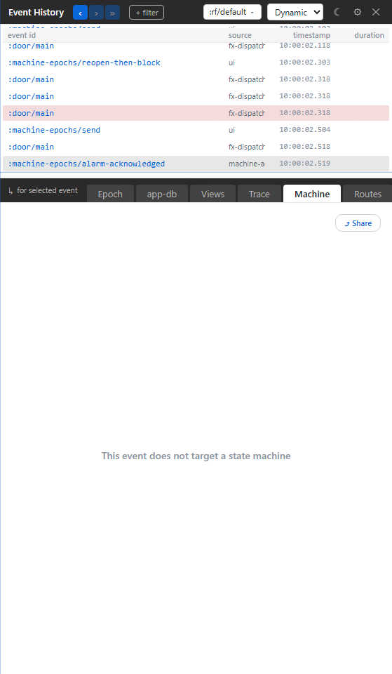

# 8. Machine Inspector

Your bug is not a value; it is a process. This chapter shows how Xray reads re-frame2 state machines: Dynamic mode explains what one epoch did to a machine, while Static mode lets you browse machine definitions and topology.

## Dynamic Machine

The Dynamic Machine tab is event-coupled. It is useful when the focused epoch touched a machine.

It can show:

- the affected machine;
- the active state before and after;
- the transition that fired;
- guards and actions;
- entry and exit activity;
- spawned or destroyed actors;
- `:after` timers and cancellation cascades where relevant.

If the focused epoch did not touch a machine, the tab should be quiet. That is not failure; it is honest scope.

## Static Machines

Static Machines answers a different question: "what machines are registered, and what shape do they have?"

Use it before or during debugging when you need the map:

- browse registered machine ids;
- inspect topology;
- read states and transitions;
- simulate or inspect defined paths where the panel supports it;
- compare definition shape to live snapshots.

Dynamic is the black box recorder for one transition. Static is the diagram on the wall.

## A Good Machine Debugging Loop

When a machine flow behaves wrongly:

1. Reproduce the action.
2. Click the event row in the spine.
3. Open Dynamic Machine and read the transition.
4. If the transition is surprising, flip to Static Machines and inspect the definition.
5. Return to Epoch or Trace for the exact guard/action records.

That loop keeps you out of the most common machine-debugging trap: staring at the current state while forgetting the event that moved it there.

## Why Machines Are Especially Good In Xray

Machines have a small, named state space. Xray can exploit that. A generic logger can tell you "something updated a map"; Xray can tell you "this event moved `:door/main` from `:closed` to `:opening`, ran this guard, scheduled this timer, and cancelled that prior branch."

That is the difference between seeing state and seeing behavior.
