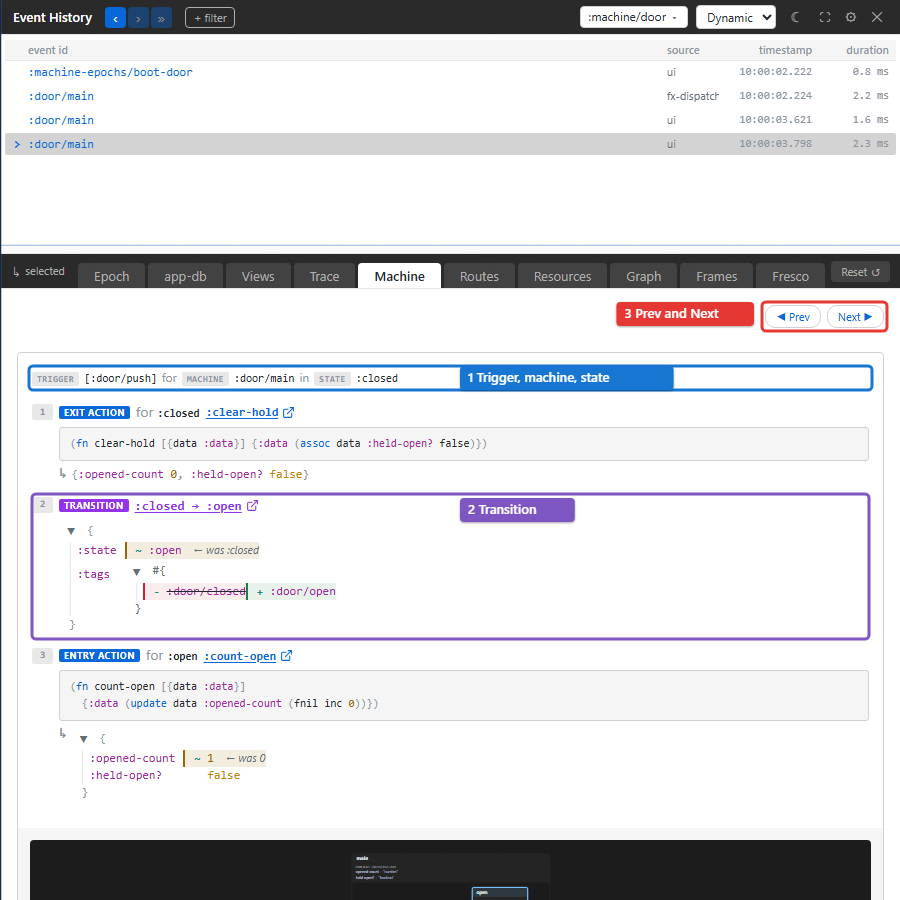

# Machine inspector

A state machine did something you did not expect. Select the triggering event to see whether `:door/push` moved `:door/main` from `:closed` to `:open`, and ran `:clear-hold` on the way out and `:count-open` on the way in. Compare the data each action wrote. Dynamic mode shows what one event did to a machine; Static mode shows every machine's definition.

## Try a transition

```powershell
cd implementation
npm run dev -- :examples/machine-epochs
```

Open `http://localhost:8033`, choose the door machine in the example's rail,
and step until `:door/push` runs. The example gives each machine its own
frame, so choosing a track also changes the frame Xray observes. Select the
push event and open **Machine**. Compare the exit action, transition and
entry action before looking at the chart.

## Dynamic Machine

The Dynamic Machine tab shows the one machine the focused event targeted. A header line (1 in the screenshot) names the trigger event, the machine and the state it was in, and numbered rows follow in the order the machine ran them, the same rows the Epoch tab shows under EVENT HANDLER:

- **GUARD** for each guard the machine checked;
- **ACTION** for each action, labelled by when it ran, such as **EXIT ACTION** or **ENTRY ACTION**, with the data it produced;
- **TRANSITION** with the state and tags before and after (2);
- **ALWAYS** for an eventless `:always` transition, and **TIMER** for an `:after` timer;
- **START** when the event created the machine, and **NO OP** when the machine had no transition for the event.

When a destroyed child actor aborts work it had in flight, that cancellation cascade is in Trace, behind the **⟲** button ([Cancellation cascades](04-trace-stream.md#cancellation-cascades)).

If the focused event did not target a machine, the tab reads only "This event does not target a state machine".

Below the rows, the machine's chart marks the state it left with a dashed outline and the state it entered in bold, and draws a countdown ring on each state with an `:after` timer running. The chart has its own zoom, pan and fit controls. **◀ Prev** and **Next ▶** (3) step to the previous and next event that touched the same machine. An app that registers no machines reads "No machines registered.", and a machine whose definition cannot be read shows "No introspectable definition — chart cannot render." in place of the chart.

[](../images/xray/xray-tutorial-machine.png)

## Static machines

Static Machines answers a different question: which machines are registered, and what shape do they have? Use it to browse machine ids, read their states and transitions, and try a definition out without touching your app.

Pick a machine to see its source link, how many states it has and how many instances are live, and four views of it:

- **Topology** draws the chart. **Copy Mermaid** copies it as a Mermaid diagram.
- **Sim** runs a copy of the definition, starting from its initial state, and never touches your app. Type an event and an optional EDN payload and press **Step ▶︎**, or click a transition on the chart. A failed guard shows inline and the state stays put. A timer on the current state can be fired by hand, since the simulator keeps no clock. **Reset** returns to the initial state and **Exit Sim** leaves.
- **Instances** jumps to the machine's live instances in Dynamic mode.
- **Cascade** is disabled here, because cancellation cascades belong to Dynamic mode.

## A machine debugging loop

When a machine behaves wrongly:

1. Reproduce the action.
2. Click the event in the event list.
3. Open Dynamic Machine and read the transition.
4. If the transition is surprising, switch to Static Machines and read the definition.
5. Go back to Epoch or Trace for the exact guard and action records.

Start from the event that moved the machine, not from its current state: the current state tells you where the machine is, and only the event tells you how it got there.

## Troubleshooting

| Symptom | Meaning | Action |
| --- | --- | --- |
| “This event does not target a state machine” | The selected event did not run a machine | Select the machine event, not the parent runner event |
| **NO OP** | No eligible transition was taken | Check the current state and event id, then inspect guards |
| A guard failed | Its predicate rejected this transition | Read its input data and source; compare the intended condition |
| “No introspectable definition” | The chart cannot read the definition | Inspect retained action/transition evidence and the machine registration |
| The simulator reports invalid EDN | The event payload cannot be read | Correct the payload before stepping; keep real app effects out of the simulation |
