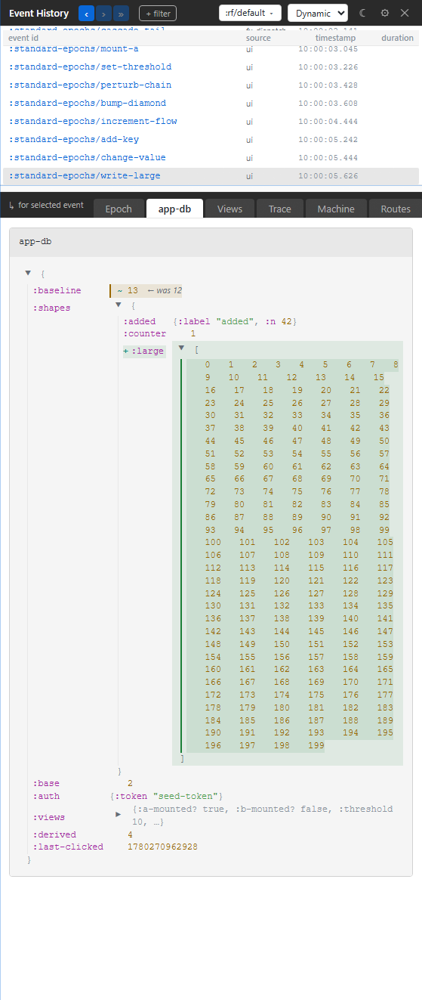

# 9. App-DB Diff

You know which event ran; now you need to know what state changed. This chapter teaches the app-db panel: changed slices first, path-oriented inspection, read-only posture, and when to prefer Trace or Epoch instead.

## Changed Slices First

The app-db panel compares the focused epoch's `:db-before` and `:db-after`. It starts with the parts that changed because that is usually the question.

This is not a giant tree dump on first paint. Giant tree dumps are where useful questions go to become archaeology.

Use app-db when you are asking:

- Did the handler write the path I expected?
- Did a runtime-managed slice change?
- Did a rollback preserve the old state?
- Did a route, request, machine, or flow put data where I think it did?
- Did a large or sensitive value get elided before display?

## Read-Only By Design

Xray does not edit app-db. That is a feature, not a missing form field.

The app-db panel is evidence. If you want to change state, dispatch an event, use a test frame, restore an epoch deliberately, or use the pair/MCP surface with the appropriate write permission. Xray keeps the diagnostic panel honest by not becoming an ad hoc state editor.

## Paths Are The Handle

The panel is path-oriented. Follow path chips to drill into a slice or open a segment inspector where available. This makes large app-db values manageable because you can stay at the meaningful boundary instead of expanding everything.

Good app-db debugging usually looks like this:

1. Open the focused event in Epoch.
2. Move to app-db for the changed slices.
3. Drill only the suspicious path.
4. Check downstream subscriptions in Views if the UI still looks wrong.
5. Drop to Trace if you need exact operation order.

## Runtime-Owned Slices

Some app-db paths are owned by re-frame2 runtime features: machines, routing, managed requests, flows, and related process state. You read those paths, but you do not hand-edit them.

That matters in Xray because the panel can show you framework-owned process state without implying that user handlers should write it directly. If a runtime-owned slice changed, ask which event or effect asked the runtime to advance the process.

## Redaction And Elision

Sensitive and large values are rendered through the same classification rules used by the rest of the tooling. Seeing `:rf/redacted` or a large-value marker is not a broken diff. It is the system refusing to spray secrets or huge payloads through the tool surface.

The path, marker, and surrounding context should still be enough to tell you what kind of value changed and where to look next.
