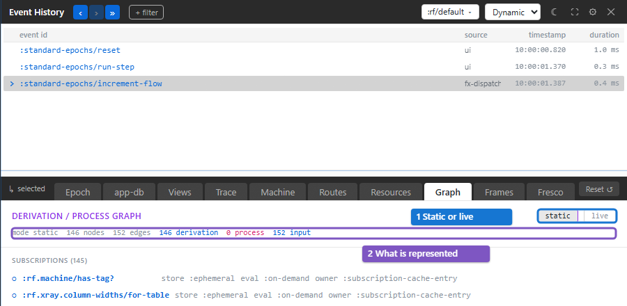
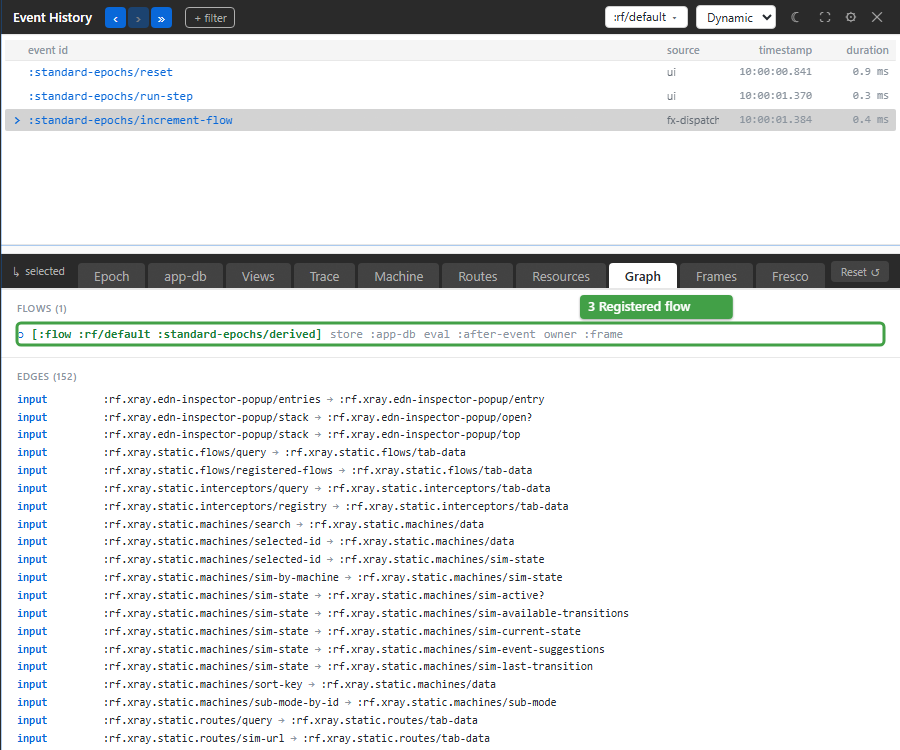

# Find what feeds a value

Use **Graph** when you need to trace a derived value's dependencies without
reproducing a particular event. The panel lists subscription, flow, resource,
route and machine nodes and the edges between them.

## Inspect the example's flow

Run step 5 in `standard-epochs`, then open **Graph**. The default **static**
mode lists registered definitions. The header counts the represented nodes
and edges (2).

Scroll past **Subscriptions** to **Flows** and find
`:standard-epochs/derived` (3). Its row says that it stores its result in
`:app-db`, evaluates `:after-event` and lives as long as its frame.

This flow calculates from `[:base]` and writes to `[:derived]`. Read its
calculation and declared paths in Static → **Flows**; Graph describes its
classification and relationships.

Switch to **live** (1) to inspect the concrete queries, machine instances,
route slice and cache entries in the observed frame. Mount Child A with
step 6, then compare the live subscriptions with the registered ones.
A parametric subscription contributes concrete input edges only when its
query has been realized.

Use Static → **Flows** when you want a flow's registration details alone.
Use Epoch → **FLOW** when you want the value it wrote during one event.

## Read a node

A **derivation** (○) computes from inputs. A **process** (◆) retains state,
such as a resource cache entry or machine snapshot. The row's labels help
you decide where to investigate:

| Label | Question answered | Example |
| --- | --- | --- |
| `store` | Where is the value stored locally? | A flow writes `:app-db`; a resource uses `:runtime-db` |
| `eval` | What triggers evaluation? | A subscription is `:on-demand`; a flow is `:after-event` |
| `owner` | Which lifetime keeps it alive? | A frame, subscription-cache entry, route or machine instance |
| `authority` | Does its source of truth live elsewhere? | A resource can be `:remote` while cached locally |
| `parametric` | Does its dependency set need a concrete query? | A subscription with an argument |

Edges identify input, parameter and selector relationships. A missing
family section means the current graph has no nodes in that family.
The [derivations guide](../core/derivations-and-algebra-views.md#the-five-questions-every-node-answers)
explains the full classification vocabulary.

## Troubleshooting

| Symptom | Meaning | Action |
| --- | --- | --- |
| A parametric sub has no static edges | Its inputs depend on a realized query | Read it in the app and inspect live mode |
| A live graph is empty | The selected frame is missing, destroyed or has no realized nodes | Choose the live app frame and reproduce its reads |
| Registered nodes exist but no edges connect them | No relationship is known in this mode | Check the definitions and compare live mode; a node's presence does not imply an edge |
| Selecting an older event does not change the graph | Graph is a structural/current-state view | Use Epoch, Views or Trace for that event |

Opening Graph dispatches no application event and keeps no application
resource alive. Exporting graph evidence through another tool applies that
tool's egress profile; classified value fields can be redacted even when the
node ids and relationships remain visible.
