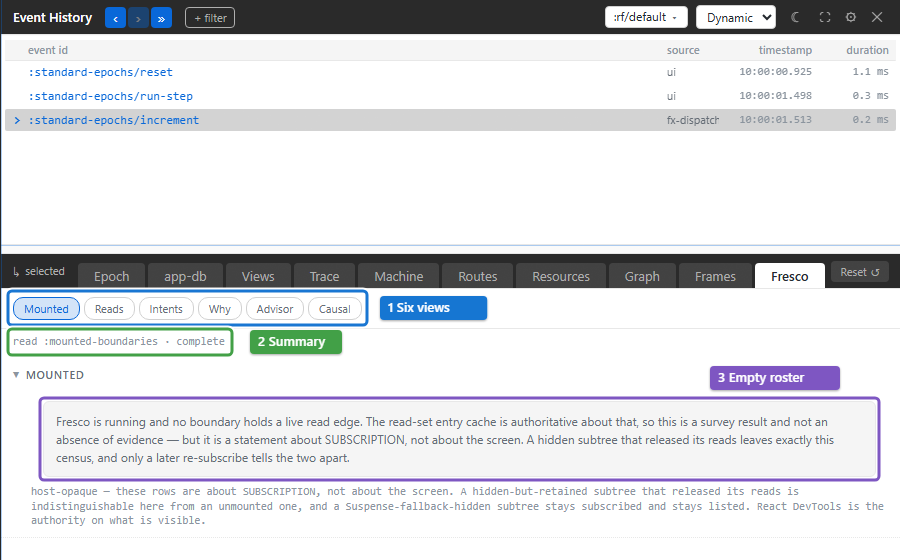

# Investigate a Fresco view

Use the **Fresco** tab when a Fresco view reads too much, recomputes too often
or appears expensive. A **boundary** is Fresco's independently re-rendering
view. The tab shows its reads and retained activity, then identifies what
the available measurements can explain.

For one event's subscription and render records, [Views](views.md) is often
enough. Fresco adds the current read sets and a wider retained window.

## Choose the view for your question

| View | Use it to answer |
| --- | --- |
| **Mounted** | Which boundary read sets and instances are present, and over which frames? |
| **Reads** | Which boundaries read this subscription? |
| **Intents** | Which dispatches remain in the retained window? |
| **Why** | Which reads changed, and what cause does the evidence support? |
| **Advisor** | Which boundary shows pressure, and which measured work accounts for it? |
| **Causal** | Which parts of the selected dispatch's event-to-view chain are actually linked? |

Reproduce the interaction, then read **Advisor**. If subscription computation
dominates, open **Reads** and inspect the costly subscription. If the read
set is the problem, inspect the broad inputs and readers. Follow the source
link to change the smallest relevant computation or dependency.

If Advisor cannot attribute the pressure, use the tool it names. Re-render
timing does not prove a React commit or a browser paint.

## Read an empty view accurately

The Fresco tab is always present. The `standard-epochs` example uses Reagent,
so its empty Mounted roster is useful for learning what an empty result says:

[](../images/xray/xray-tutorial-fresco.png)

An empty Mounted roster means there are no boundary read edges in this
survey. It does not prove that no elements are on screen. Reads can be empty
for mounted views that read no subscriptions. Intents can be empty because
no dispatch remains in its bounded window. Increasing retention never
recovers work already dropped; reproduce the interaction again.

## Interpret the evidence labels

| Label | Meaning | Action |
| --- | --- | --- |
| **No Fresco evidence** | The reader returned no dev evidence | Check the inspected build; production evidence is compiled out |
| **Schema mismatch** | This Xray build cannot read the producer's format | Align the Xray and Fresco versions |
| **capped** | Retention bounds what can be known | Reproduce with evidence enabled and retained |
| **opaque** | The runtime does not retain that fact | Use evidence that is available instead |
| **host-opaque** | React owns the missing fact | Use React DevTools or browser performance tools |
| **uncorrelated** | Facts exist without an id joining them | Treat them as leads rather than a proven cause |
| **unknown** | That field was not observed or retained | Do not read it as zero or an empty result |

## Follow one dispatch

Select an event and open **Causal**. It follows the dispatch through the
event, subscription recomputations, changed values and notified boundaries.
Each link states both its evidence and whether it joins to the preceding link.
Temporal proximity alone is insufficient.

Actual body execution, React commit and browser paint are outside what this
chain can prove. Follow its named tool when you reach that limit. With no
focused retained dispatch, Causal uses the newest retained one.

## Focusing the tab from a host

For an already-mounted Xray host:

```clojure
(require '[day8.re-frame2-xray.core :as xray])
(xray/focus! {:panel :fresco})
```

The [focus reference](api/mount-control.md#focusing-a-panel-from-a-host)
documents selecting a frame and epoch too. The
[Fresco diagnostics guide](../core/fresco/16-diagnostics.md) explains changes
that address each pressure class.
