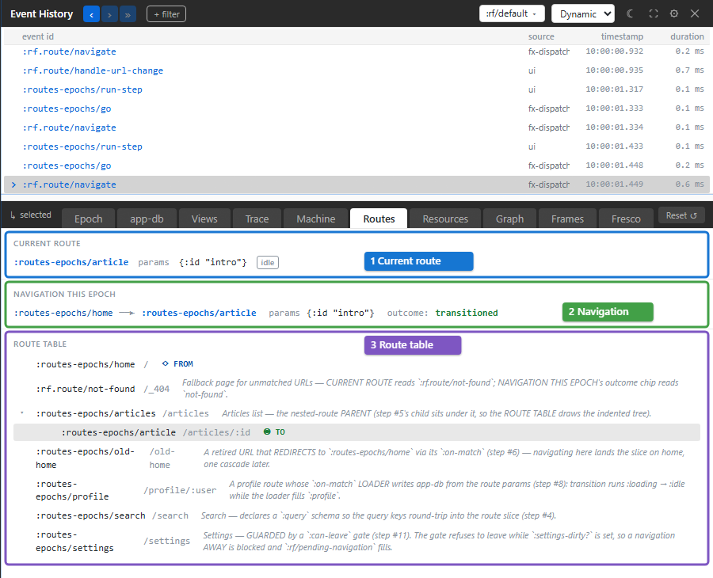
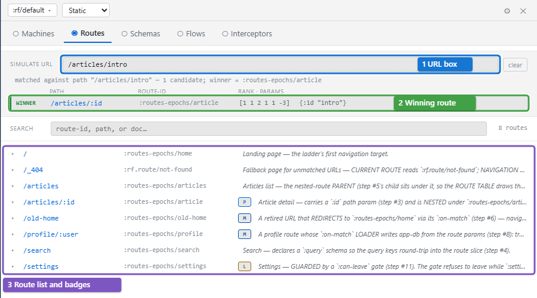

# Routes

Navigation went wrong: the app landed on the wrong page, a guard refused to leave, or a route param is missing. Xray has two Routes tabs. The Dynamic Routes tab shows what the focused event did to navigation. The Static Routes tab lists the registered routes and shows which route a URL would match.

## The Dynamic Routes tab

[](../images/xray/xray-tutorial-routes.png)

The tab has three sections, numbered in the screenshot:

1. **Current route** is the route the frame is on now: its id, its params, the query and fragment when there are any, and a chip reading `idle`, `loading` or `error` for the route's loading state. Hover an `error` chip for the error. This section shows the app's state now, not the focused event's.
2. **Navigation this epoch** shows what the focused event did to navigation: the route it left, an arrow, the route it went to, the params, and the outcome. The outcome is `transitioned` for a navigation that completed, `blocked` when a `:can-leave` guard refused to leave, `entry denied` when the target route's `:can-enter` guard refused, `not-found` when no route matched, and `fragment changed` when only the URL fragment moved.
3. **Route table** lists every registered route with its path, indented under its `:parent`. When the focused event navigated, **◉ TO** marks the route it went to and **◇ FROM** the route it left; when it did not, **◀ current** marks the current route. **↻ cycle** marks a route whose `:parent` chain loops back on itself.

Each section says when it has nothing to show: "No active route.", "No route activity in this epoch." or, for an app with no routes, "No routes registered in the host app."

Params and query values that the route declares sensitive show as `:rf/redacted`.

## Try it

The routes-epochs testbed in this repository walks through the common navigation cases:

```powershell
cd implementation
npm run dev -- :examples/routes-epochs
```

Open `http://localhost:8032`, open the Routes tab, and click the numbered steps on the left. Xray follows the newest event, which after most steps is the step's `:rf.route/navigate`:

- **3. route params (/articles/:id)** navigates to `/articles/intro`. The current route is `:routes-epochs/article` with params `{:id "intro"}`, and the outcome is `transitioned`.
- **7. not-found / fallback** navigates to a URL no route matches. The current route is `:rf.route/not-found`, and the outcome is `not-found`.
- **10. enter dirty settings** and then **11. try to leave** show a `:can-leave` guard at work. The newest event is now `:rf.route/navigation-blocked`; click the `:rf.route/navigate` row above it. Its outcome is `blocked`, and the current route stays `:routes-epochs/settings`.

## The Static Routes tab

Switch to Static mode (Ctrl+Shift+M) and open **Routes** to browse the route table without any event.

[](../images/xray/xray-tutorial-routes-static.png)

1. **Simulate URL** matches a URL against the route table without navigating. Type a path, such as `/articles/intro`; Xray ignores any origin, query or fragment. It lists every route whose pattern matches, most specific first, with the params each would receive.
2. The first match is marked **WINNER**: it is the route a real navigation to that URL would reach. Each row also shows the raw rank the router sorted by.
3. Below, every route is listed by path, with **Search** to filter by id, path or doc string. Badges mark what a route declares: **M** an `:on-match` event, **L** a `:can-leave` guard, **T** tags and **P** a parent.

Click a route to expand it. The expansion shows its id, path, `:on-match` event and a source link, the keys it matches, its params and query schemas, and its registration metadata. **Simulate navigation** previews what the route would write into the frame's route state, and dispatches nothing. **→ Dynamic** switches to the Dynamic Routes tab.

## A routes debugging loop

When navigation goes wrong:

1. Click the event that navigated, or that should have.
2. Open Routes and read **Navigation this epoch**: where it went, and the outcome.
3. If the outcome is `blocked` or `entry denied`, open Epoch or Trace for the guard that refused.
4. If the wrong route matched, switch to Static mode and try the URL in **Simulate URL**.

To see the route state itself, open the app-db tab: the `:rf/route` and `:rf/pending-navigation` cards hold it.

## Troubleshooting

| Symptom | Meaning | Action |
| --- | --- | --- |
| Current route and an older event's destination differ | One is live state; the other is historical navigation | Read **Navigation this epoch** for the selected event |
| **blocked** | The leaving route's guard prevented navigation | Inspect `:can-leave` and its input state |
| **entry denied** | The destination's guard prevented entry | Inspect `:can-enter` before changing path matching |
| **not-found** | No route matched the requested path | Try the URL in Static Routes and compare patterns |
| A URL simulation matches but navigation still fails | Simulation checks matching, not the real transition's guard outcome | Inspect the actual navigation event |
| **↻ cycle** | The parent chain loops | Correct the route registrations' `:parent` links |
