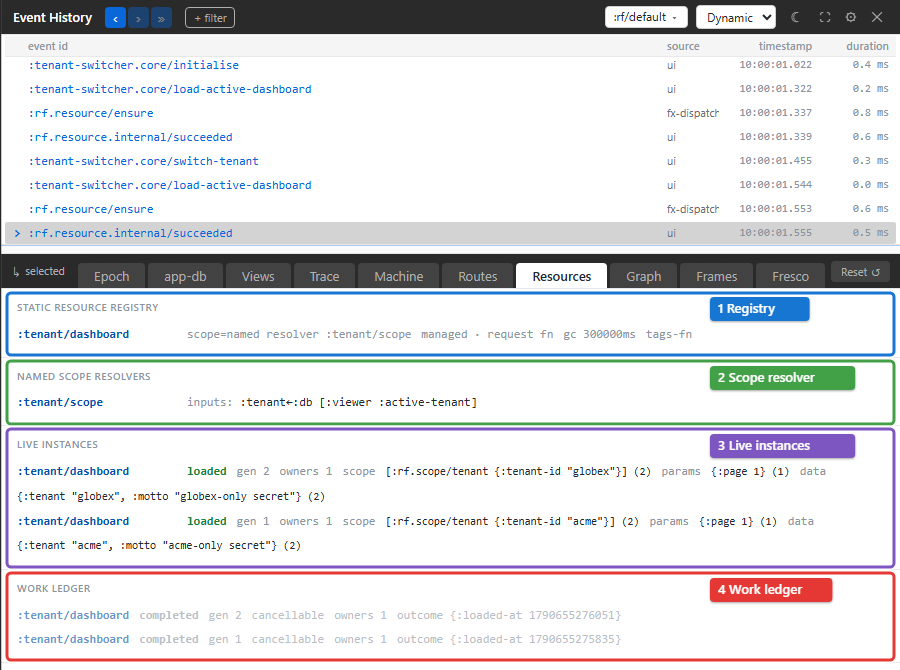

# Resources

Server data looks wrong: a screen shows stale data, a request never finishes, or the cache keeps growing. The Resources tab shows the resources the observed frame has: what is registered, what is cached, what is in flight, and what loaded, invalidated or evicted each entry.

It shows the frame's state now. Picking an event changes which frame the tab reads, if the event came from another frame, but not the point in time: the tab does not rewind to the focused epoch. To see what one event did to a resource, open its Epoch or Trace.

## Reading the tab

[](../images/xray/xray-tutorial-resources.png)

The tab stacks one section per question. The four at the top, numbered in the screenshot, are the ones you read most:

1. **Static resource registry** lists each registered resource with its scope (a named resolver, `global (explicit claim)`, or `MISSING`), how it requests data, its stale and garbage-collection times in milliseconds when it declares them, and whether it has a tags function, is marked `sensitive`, or is loaded by routes.
2. **Named scope resolvers** lists the resolvers that decide which cache entry a read addresses, and the app-db inputs each reads.
3. **Live instances** lists the cache entries in this frame: the resource, its status (`loaded`, `loading`, `fetching`, `error` or `idle`), whether it is `stale`, its generation, how many owners keep it alive (`gc-eligible` when none do), and summaries of its scope, params and data.
4. **Work ledger** lists each load attempt, running or finished: its status, whether it can be cancelled, its deadline and attempt number, and how it ended. Finished attempts are dimmed and listed last.

The last section, **Scope audit + lints**, sits at the bottom of the tab. It lists the resources that claim the global scope, and warns about anything suspicious. For example, "orphaned owner … pins …" means an owner your app attached is keeping a cache entry alive and Xray has seen no release for it. Owners that routes, machines and server rendering attach are released by the framework, so they are not checked.

The sections in between answer more specific questions:

| Section | Shows |
| --- | --- |
| What is still running? | Requests and other managed work still in flight in this frame. Hidden when there is none. |
| Stale races | Replies that arrived after a newer request had replaced them, and were ignored. Hidden when there is none. |
| Route / resource graph | Each route that declares `:resources`, whether it waits for them (`blocking`, and `SSR wait point` for server rendering), and how fresh each one is. |
| Lifecycle timeline | Each fetch start, success, failure, cache hit, invalidation and eviction, in order. |
| Invalidation / mutation graph | Each invalidation, the tags it matched, and the entries it refetched. |
| Scope resolution timeline | Each time a scope resolver ran, what it read, and the scope it produced, or `resolved nil`. |
| Mutation continuations + scoped invalidation | What each mutation invalidated, and the events its replies dispatched. |
| Optimistic mutations | Each optimistic write and whether it was confirmed, rolled back or superseded. |
| Cache growth | How many entries each resource holds, and how many could be evicted. |

The timeline sections read everything Xray has retained, not only the focused event, so older activity stays visible until it falls out of the trace buffer.

An app that registers no resources reads "No resources registered in the host app."

## Values are summarised

Scopes, params and data are shown as short summaries: a preview of at most 120 characters, and the collection's size. A value the frame declares sensitive, or a resource marked `:sensitive?`, shows as `[redacted]`, and a value too large to show reads `[large — elided]`. Scopes often carry user or tenant ids, so they are summarised the same way as data.

## Opening the tab changes nothing

The tab only reads. It does not load, refetch or keep any resource alive, so looking at a resource never changes when it is evicted.

## Try it

The tenant-switcher testbed has one resource, `:tenant/dashboard`, scoped by the active tenant, with a stubbed server so it works offline:

```powershell
cd implementation
npm run dev -- :testbeds/tenant-switcher
```

Open `http://localhost:8060`:

1. Press **Load active dashboard**. Live instances shows one `loaded` entry for Acme Corp, and the Work ledger shows the attempt that loaded it.
2. Press **Globex Inc**, then **Load active dashboard** again. A second entry appears: the scope resolver gave the same `{:page 1}` params a different tenant scope, so the two tenants never share an entry.
3. Scroll to **Scope audit + lints** at the bottom of the tab. The testbed's owner never releases its entries, so the audit reports it as an orphaned owner.

## A resources debugging loop

When server data looks wrong:

1. Find the entry in **Live instances**. Check its status, whether it is stale, and its owners.
2. If it is stale or keeps reloading, read the **Lifecycle timeline** and the **Invalidation / mutation graph** for what invalidated it.
3. If a request seems stuck, read **What is still running?** and the **Work ledger**.
4. If two users or tenants see each other's data, compare the scopes in **Live instances** and read the **Scope resolution timeline**.
5. For the exact records behind any of these, focus the event in the event list and open Trace.

## Read an instance's status

| Status | Meaning | Check next |
| --- | --- | --- |
| `idle` | No loaded result or active fetch is represented | The declaration, demand and scope resolution |
| `loading` | Initial data is being fetched | The active work and reply evidence |
| `fetching` | Existing data is being refreshed | Freshness, invalidation and the work ledger |
| `loaded` | A value was loaded | Whether it is stale and which scope/params identify it |
| `error` | The load failed | Failure details and retry policy |

The **stale** marker is separate from status: retained data can exist while
requiring a refresh. An entry's generation identifies a fetch lineage; do not
compare a late reply to a newer entry solely by resource id.

## Troubleshooting

| Symptom | Check | Action |
| --- | --- | --- |
| A tenant sees another tenant's data | Resolved scope and cache key | Fix the resolver inputs; identical params still need distinct scopes |
| The cache keeps growing | Owner count and Cache growth | Release application-owned entries at the intended lifetime |
| An entry remains pinned | **Scope audit + lints** | Check the application's attach/release pairing |
| A reply was ignored | Stale races and generations | Check whether a newer request or invalidation replaced that attempt |
| Selecting old events does not rewind instances | Resources shows current state | Read the old event in Epoch or Trace |
| Merely opening the tab seems to fetch | The inspector does not create demand | Inspect the app's readers, route requirements or explicit loads |
