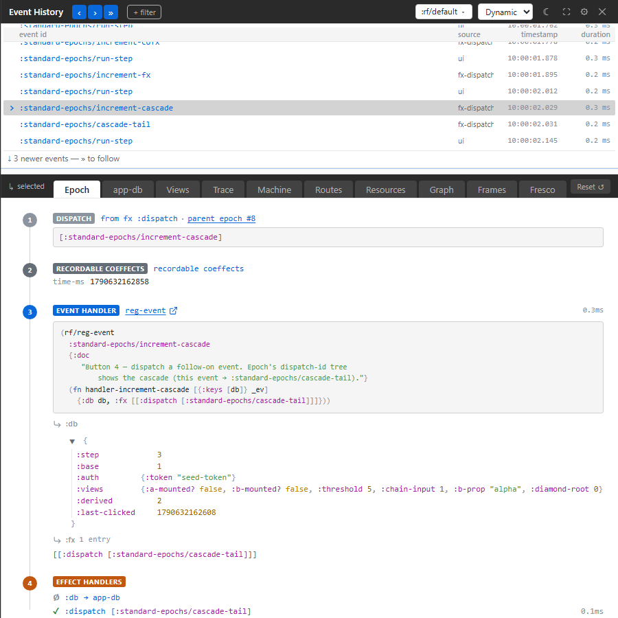
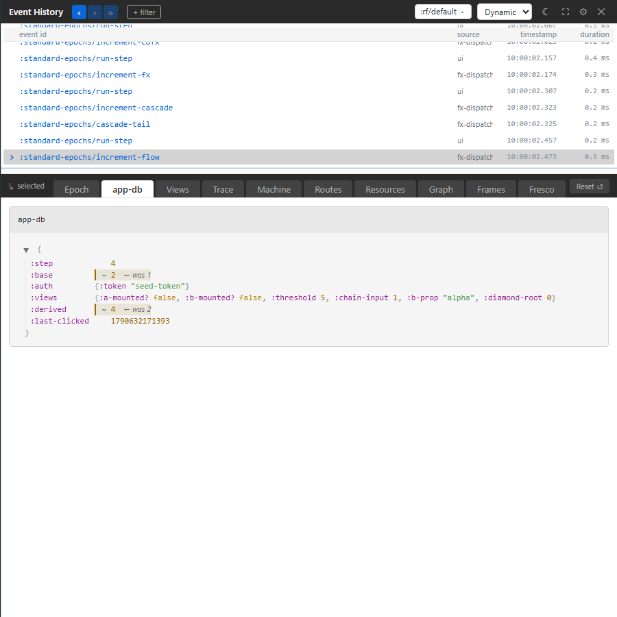

# Follow an event from input to state

An interaction changed more state than you expected. Follow one event through
its handler and a derived value, then check the state it actually installed.
The `standard-epochs` example supplies the registrations and Xray setup for
this exercise.

```powershell
# From the re-frame2 checkout
cd implementation
npm ci
npm run dev -- :examples/standard-epochs
```

Open `http://localhost:8031`. Click **Run** beside **step 5**, which runs
`:standard-epochs/increment-flow`. If you have already used the example,
reload first so the starting values are the same.

The handler being exercised is small:

```clojure
;; cf. tools/xray/testbeds/standard_epochs/core.cljs
(require '[re-frame.core :as rf])

(rf/reg-event :standard-epochs/increment-flow
  (fn [{:keys [db]} _event]
    {:db (update db :base inc)}))
```

The example starts with `:base` equal to `1`. A registered flow calculates
`(* 2 base)` and writes it to `:derived`. You should finish with `:base 2`
and `:derived 4`.

## Read the event that did the work

Choose the app's frame in the ribbon if none is selected. The runner produces
both a `:standard-epochs/run-step` event, which updates its step cursor, and
the child event `:standard-epochs/increment-flow`. Select the child event,
then open **Epoch**.

Read the numbered steps in order:

1. **DISPATCH** identifies the event vector and where the dispatch came from.
2. **EVENT HANDLER** shows the handler's source and its returned `:db` and
   `:fx`. Here, `:base` changed from `1` to `2`.
3. **FLOW** shows the derived write. The handler did not write `:derived`;
   the flow did.
4. **SUBSCRIPTIONS** and **VIEWS**, when present, show the work that reacted
   to these changes. Steps with no evidence are omitted.

[](../images/xray/xray-tutorial-epoch.png)

The screenshot uses the example's cascade step, which also dispatches a
follow-up event. The controls and numbered steps are the same. A child
dispatch has its own event row; it is not another handler inside the parent's
epoch.

## Confirm the result

Open **app-db** and find `:base` and `:derived`. The tree shows the state
after your selected event. `← was` marks the old value beside each changed
value. The screenshot below shows this same flow after the example's first
five steps.

[](../images/xray/xray-tutorial-app-db.png)

Run step 5 again and select its newest child event. Now the values should be
`:base 3` and `:derived 6`. Select the older row again: Xray still shows
`2` and `4`, while the live example remains at `3` and `6`.

This separates two common bugs: the handler wrote the wrong input, or a
downstream computation produced the wrong output. Follow the source link on
the step responsible for the unexpected value.

## Troubleshooting

| Symptom | Check | Action |
| --- | --- | --- |
| Only `:step` changed | You selected the runner's `run-step` event | Select `:standard-epochs/increment-flow` |
| The expected values are higher | The example has already run | Reload and run step 5 once |
| The detail panel stays on the old event | An older row is selected or following is paused | Select the new row, or press **»** to follow |
| No event appears | Frame selection, filters and mutes | Choose the app frame and remove the filters hiding it |
| A row has no epoch | It was rejected before settling, is still running, or its evidence is no longer retained | Reproduce the action and inspect its newest completed row |
