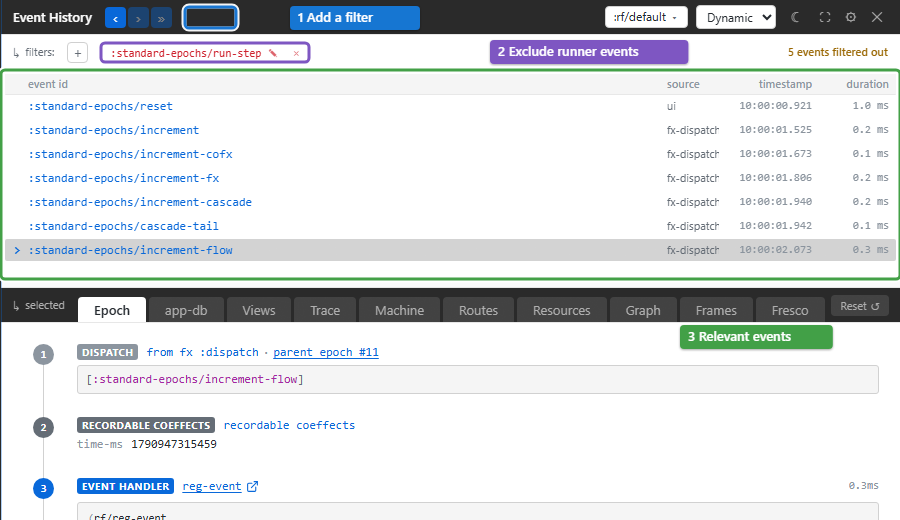
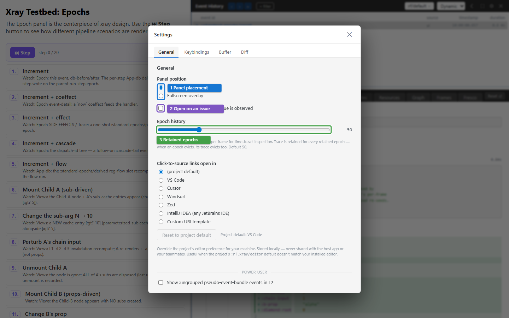

# Keep a debugging session readable

A busy app can bury the event you are investigating. Filter the event list,
keep enough history for the reproduction, and distinguish hidden evidence
from evidence the runtime never recorded.

## Filters

Click **+ filter** and choose an IN or OUT pattern. IN retains matching
events; OUT excludes them. With no IN pills, everything is included before
the exclusions are applied.

| Pattern | Matches |
| --- | --- |
| `:standard-epochs/increment-flow` | That exact event id |
| `:standard-epochs/*` | Every event id in that namespace |
| `:standard-epochs` | That id and ids in that namespace |
| `increment` | Any event id containing that text |

[](../images/xray/xray-tutorial-filters.png)

Edit a pattern with its pencil control or remove it with **✕**. Right-click
an event and choose **Always hide this event-type…** to add an exclusion,
or **Mute** to hide the id. The ribbon's **🔇 N** opens the mute manager.
Pattern pills reset on reload unless the host supplies a boot-time filter
seed. Remove both pills and mutes when checking whether an event happened.

An errored event remains visible even when a filter or mute would hide it,
with a tooltip explaining the override. Warnings do not override filters.
This behaviour is configurable in the [filter reference](api/config-keys.md#filters-cluster).

Managed-effect context menus also create filters for an effect id or one
HTTP correlation id. These include the matching activity's spawning ancestors
so you can still find the user action that caused it. They do not resurrect
evicted evidence.

## History and settings

[](../images/xray/xray-tutorial-settings.png)

**Epoch history** (3) retains successful and failed event snapshots per frame.
The separate **Buffer** tab sets the number of events kept in the framework's
trace ring. Both default to 50. Increase the relevant setting *before*
reproducing a long interaction; existing gaps stay gaps.

**Clear buffer now** asks for confirmation and drops retained evidence and
the redaction counter. Clear at the beginning of a new investigation if
needed, then reproduce the problem. Hiding Xray or pausing following does
not clear the history.

Settings are saved in the browser. A developer's explicit choice takes
precedence over the project's configured defaults on the next load. The
[configuration reference](api/config-keys.md#boot-time-config-vs-persisted-settings)
documents the precedence and exact values.

## Redacted and large values

By default Xray uses `:rf.egress/local-redacted`: classified sensitive values
display as markers, and sensitive trace events may be held back. **● REDACTED
N** reports the number held back. This is separate from an IN or OUT filter.

For trusted local inspection, configure the local raw profile:

```clojure
(require '[day8.re-frame2-xray.core :as xray])
(xray/configure! {:rf.xray/egress-profile :rf.egress/local-raw})
```

This changes Xray's local visibility, including sensitive and large values;
it does not change Story's or another tool's profile. Returning to
`:rf.egress/local-redacted` clears the trace buffer, so previously visible
raw payloads do not remain there. Choose the profile before reproducing the
interaction. A value's source link can remain useful while its value is hidden.

## Troubleshooting

| Symptom | Check | Action |
| --- | --- | --- |
| The list is empty | Frame, IN/OUT pills and mutes | Choose a live app frame and remove exclusions |
| New events are recorded but the panel stays still | Focus or paused following | Press **»** or resume with Space |
| An error remains despite an OUT filter | Error override is enabled | Inspect it, or change that setting for this investigation |
| An outside-event error is absent | Ungrouped rows are hidden by default | Enable the ungrouped option in General settings |
| A setting changes back after reload | Persisted override or host defaults | Check the documented precedence rather than changing unrelated code |
| History disappeared after changing privacy | The raw-to-redacted transition clears it | Reproduce under the new profile |
