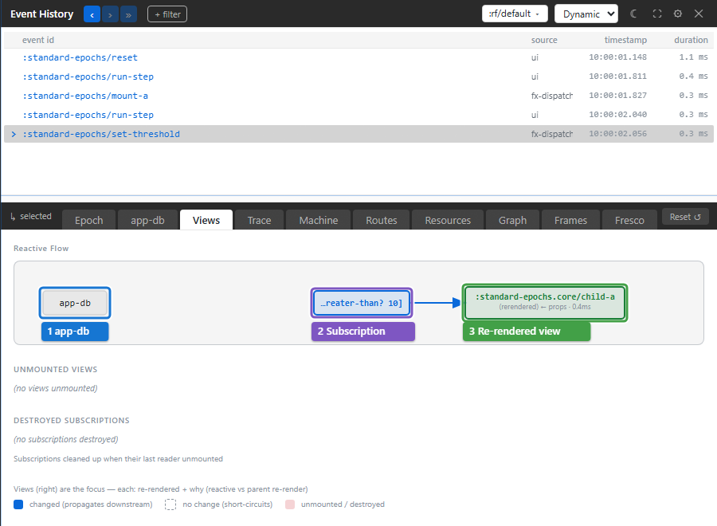

# Explain a re-render

The state changed correctly, but a view rendered too often or failed to update.
Use **Views** to connect the selected event's state changes to subscriptions
and rendered views.

In the `standard-epochs` example, reload and run **step 6** to mount Child A,
then **step 7** to change the threshold passed to it as a prop. Select
`:standard-epochs/set-threshold` and open **Views**.

Read from app-db (1) through the subscription (2) to the view (3). Child A
now reads `[:standard-epochs/greater-than? 10]`; changing the threshold creates
a different subscription query. The view's recorded cause is **props**:
its parent passed a new threshold. Seeing a subscription in the graph does
not by itself mean that a changed subscription result caused the render.

A view's node gives its render reason and recorded duration. Click a node to
open its source, or hover a view to highlight its element in the app.

## Compare subscription changes with prop changes

Run **step 8** to change Child A's input chain while keeping its threshold
prop unchanged. Its subscription recomputes and the view reacts to its
changed value. Compare this render cause with step 7. Then run **step 10** to mount
Child B and **step 11** to change its prop. Child B reads no subscriptions;
its render is caused by the prop change.

This distinction determines the fix. If a subscription does unnecessary work,
inspect its inputs and result. If the parent keeps changing props, inspect
the values it passes. A short render duration alone does not explain why
a view rendered.

Run **step 9** to unmount Child A. **Unmounted Views** and **Destroyed
Subscriptions**, below the graph, show the cleanup retained in that epoch.
An unmount is different evidence from a view that simply did not render.

## Troubleshooting

| Symptom | Check | Action |
| --- | --- | --- |
| “No subs subscribed to changed paths · no views re-rendered” | This event changed no value a mounted view reads | Choose the event that changes the relevant input |
| A subscription ran but its view did not render | Its result may still compare equal | Read the subscription result before changing the view |
| The displayed graph describes an earlier interaction | A past epoch is focused | Select the new event or follow with **»** |
| A timing spike seems to prove a slow paint | View evidence does not measure React commit or browser paint | Record a browser performance trace |

Settings → General → **Show unchanged subscriptions** includes recomputations
whose results stayed equal. Use it when investigating wasted computation;
leave it off when you only need the changes that propagated.

For Fresco read sets and per-boundary pressure, use the
[Fresco tab](11-fresco-tab.md). For dependencies that exist without this
event running, use [Graph](10-derivation-graph.md).
